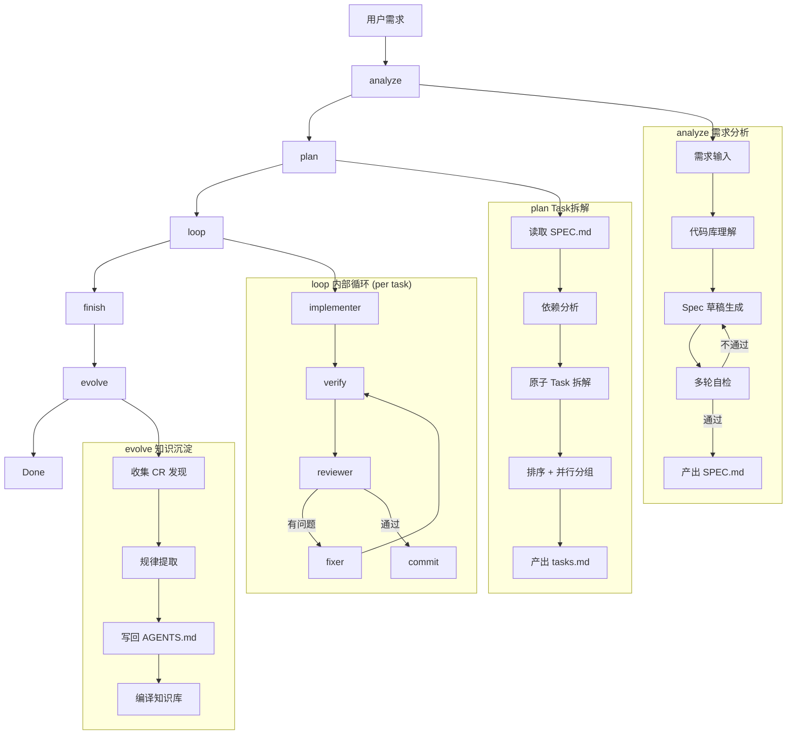

# Neil Coding Autopilot

AI 全托管开发编排器 — 从需求到部署的全自动开发流水线。

## 简介

Neil Coding Autopilot 是一个 Qoder 插件，通过 qodercli 多进程编排实现全自动化开发流程。当前会话作为控制器，每个阶段通过独立 qodercli 实例执行，各实例可配置不同模型，context 完全隔离。

## 架构



```
[控制器 - 当前会话]                        [Worker - 独立 qodercli 实例]
  │                                          │
  ├─ qodercli: analyze ──────────────────►  产出 SPEC.md
  ├─ qodercli: plan ─────────────────────►  产出 tasks.md
  ├─ loop (控制器自身遍历 tasks)
  │     ├─ qodercli: implementer ────────►  写代码
  │     ├─ verify (控制器执行编译) 
  │     ├─ qodercli: reviewer ───────────►  Code Review
  │     └─ qodercli: fixer ──────────────►  修复问题
  ├─ qodercli: finish ───────────────────►  PR / merge
  └─ qodercli: evolve ───────────────────►  知识沉淀
```

| 阶段 | 职责 |
|------|------|
| **analyze** | 需求分析 + Spec 生成 + 多轮自检 |
| **plan** | 读取 Spec → 拆解原子 Task → 写入 tasks.md |
| **loop** | Outer Loop 遍历 Task，Inner Loop 调度 worker |
| **finish** | 分支级合并（feature branch → main） |
| **evolve** | AGENTS.md 自进化 + 知识沉淀 |

## 安装

```bash
# 方式一：使用 neil-skill-installer（推荐）
python3 ~/.qoder/skills/neil-skill-installer/scripts/installer.py install \
  /path/to/neil-coding-autopilot \
  --tool qoder --scope user --scope-confirmed

# 方式二：直接运行 install.sh
./install.sh
```

## 使用

```bash
# 从需求开始全自动开发
/neil-coding-autopilot "添加用户注册功能，支持邮箱和手机号"

# 按现有 Spec 执行
/neil-coding-autopilot "按照 spec.md 开发整个项目"

# GitHub Issue 驱动
/neil-coding-autopilot --issue https://github.com/user/repo/issues/42
```

## 配置

通过环境变量控制各阶段模型和行为：

| 变量 | 默认值 | 说明 |
|------|--------|------|
| `AUTOPILOT_PLATFORM` | auto | qoder / claude / codex / auto（优先级 qoder>claude>codex） |
| `AUTOPILOT_ANALYZE_MODEL` | Ultimate | 需求分析阶段模型（需强推理） |
| `AUTOPILOT_PLAN_MODEL` | Ultimate | Task 拆解阶段模型（需强推理） |
| `AUTOPILOT_IMPLEMENTER_MODEL` | Performance | 编码型 worker 模型 |
| `AUTOPILOT_REVIEWER_MODEL` | Ultimate | 审查型 worker 模型 |
| `AUTOPILOT_FIXER_MODEL` | Performance | 修复型 worker 模型 |
| `AUTOPILOT_EVOLVE_MODEL` | Ultimate | 知识沉淀阶段模型（需强归纳） |
| `AUTOPILOT_MAX_PARALLEL` | 3 | 最大并行 Task 数 |

## 支持平台

- **Qoder** (qodercli)
- **Claude Code** (claude)
- **Codex CLI** (codex)

## 项目结构

```
├── AGENTS.md              # AI Agent 指令文档
├── SKILL.md               # 插件入口声明
├── hooks/                 # Session Hook（自动注入）
├── scripts/               # 调度脚本
└── skills/                # 各阶段 Skill 定义
    ├── autopilot-analyze/
    ├── autopilot-plan/
    ├── autopilot-loop/
    ├── autopilot-review/
    ├── autopilot-finish/
    ├── autopilot-evolve/
    └── using-neil-autopilot/
```

## License

MIT
