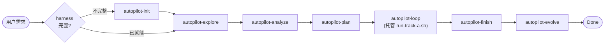
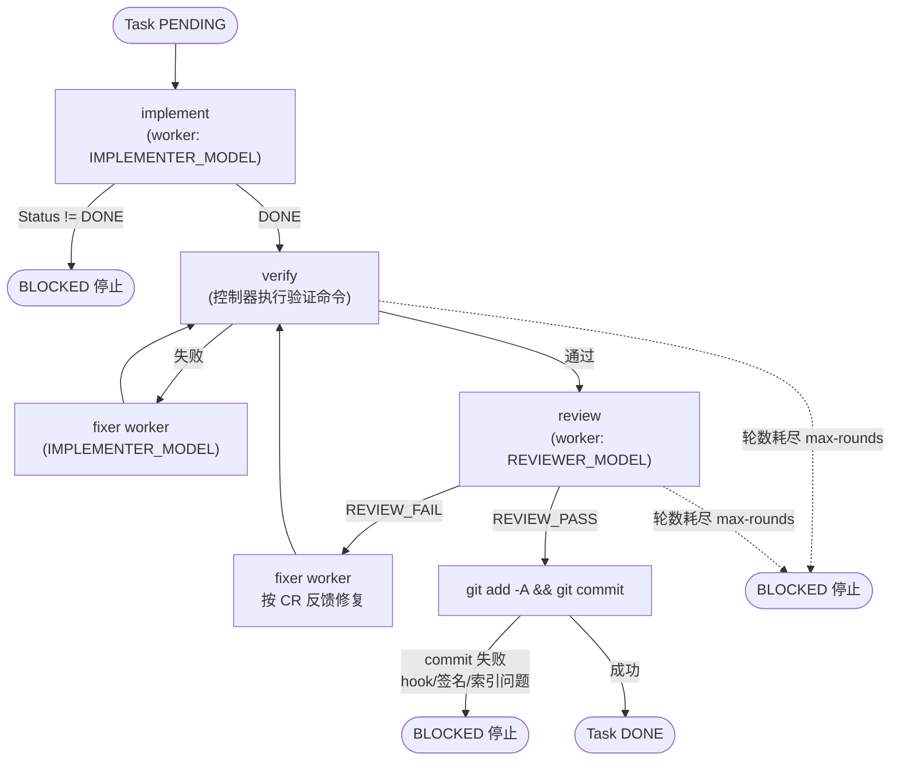
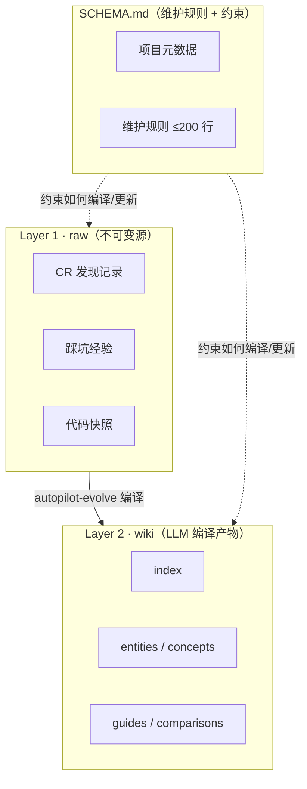

# Neil Coding Autopilot

**AI 全托管开发编排器** —— 从一句需求到合并部署，全流程交给 AI，控制器自己永不写一行代码。

## 一图看懂

**你给一句话需求，它自动跑完"澄清 → 方案 → 拆任务 → 写码 → 自测 → Code Review → 合并 → 知识沉淀"，交付经过审查和验证的代码变更——你自己不写一行代码。**


| 你提供 | AI 负责 | 你得到 |
|--------|---------|--------|
| 一句自然语言需求（或现成 Spec / GitHub Issue） | 澄清 → 设计 → 拆解 → 编码 → 自测 → Code Review → 合并 → 知识回写，全流程编排调度 | 经 CR 与验证的代码变更 + 自动沉淀的项目知识库 |

## 架构总览

顶层是一条按阶段串行推进的流水线（每个阶段之间都由 `autopilot-checkpoint` 把关、校验前置完成才放行；下图为保持清晰省略了 checkpoint 节点）：



- `spec-ready` 任务跳过 explore/analyze，直接从 plan 起步。
- 档位 A（无人值守）checkpoint 读写落盘的 `progress.md`；档位 B（交互）checkpoint 退化为控制器自查 TodoWrite，核心不变量（explore/CR/verify/evolve 已发生）依然强制。

## 核心理念

> **铁律：控制器永不内联写码。** 所有开发工作（implement → verify → review → fix → commit 内循环）一律经 `scripts/run-track-a.sh` 托管给一个全新的 qodercli worker 进程执行。

这条铁律背后是三个具体约束：

1. **开发全部外包**：无论处于哪种执行档位，控制器（当前会话）从不直接读写业务代码。它只负责生成 prompt 文件、调度 `run-track-a.sh`、读取日志摘要与状态行。
2. **控制器不读源码、不看 diff**：开发细节（读文件、写代码、跑测试、看报错）全部发生在 worker 的独立进程与独立 context 里，控制器的 context 不会随着开发工作量增长而膨胀。
3. **Context 隔离（借鉴 Anthropic subagent offload 思想）**：每一步（implement / review / fix）都 spawn 一个 *fresh* qodercli worker，worker 用完即弃，不会把上一步的脏 context 带到下一步；编排器本身是确定性 bash 脚本（`run-track-a.sh`），零 LLM context，可续跑、可 dry-run、可审计。

这也是为什么架构里明确反对"起一个 qodercli 当编排器让它自己读 SKILL 循环"——那样只是把 context 腐化（context-rot）从 worker 转移到了编排器本身，还会让运行变得不确定、难以调试。

## loop 内循环

`autopilot-loop` 阶段内部，针对**单个 Task** 的执行是一个 implement → verify → review → fix 的内循环，全程 fail-closed（任一环节失败即停，绝不静默通过）：



关键点：
- **verify 由控制器（脚本）自己跑**，从不相信 worker 的自我报告。
- `review` 结果是三态，只有明确 `REVIEW_PASS` 才允许 commit；三态见下表：

| REVIEW 状态 | 判定条件 | loop 后果 |
|-------------|----------|-----------|
| `REVIEW_PASS` | 全部文件已审、且只有 MINOR 或无问题 | 允许 `git commit` |
| `REVIEW_FAIL` | 存在 CRITICAL / MAJOR 问题 | 调度 fixer worker 修复后重审 |
| `REVIEW_INCOMPLETE` | 有文件未被审查（重试后仍未消解） | 不得静默 PASS、不得进入 finish，交由控制器决定（人工审 / 缩小 diff 再审 / 显式豁免）；核心原则：未经审查的变更不能静默通过 |

- 达到 `--max-rounds`（默认 3）仍未通过，或 commit 本身失败（钩子拒绝/签名/索引脏），都会立即 `exit 2`，标记该 Task 为 `BLOCKED`，绝不假装成功。

## 执行档位

| 对比项 | 档位 A · 无人值守（Autonomous） | 档位 B · 交互（Interactive） |
|--------|-------------------------------|------------------------------|
| 适用场景 | CI / 后台批量 / spec-ready / 需求已明确 | 会话内协作 / 需求要边聊边澄清 |
| 外层阶段（explore/analyze/plan/finish/evolve） | headless（spec-ready 时跳过 explore/analyze） | 控制器在会话内跟用户交互，可随时插话 |
| loop（开发） | 从终端直接起 `run-track-a.sh` 端到端跑完 | 控制器在会话内 `bash run-track-a.sh ...` 托管 |
| 状态源 | `progress.md` + `tasks.md`（脚本维护） | TodoWrite（阶段级）+ `tasks.md`（Task 级，脚本维护）+ `spec.md` |
| 阶段完成标记 | `autopilot-checkpoint` 写 `progress.md` | 自查前置不变量 + TodoWrite 标记完成 |
| 恢复/断点续跑 | 读 `progress.md` + `run-track-a.sh --resume` | 读 TodoWrite + `run-track-a.sh --resume` |

**判定规则**：
- 需求要跟用户边聊边澄清 / 期望边做边看 → **档位 B**。
- 需求已明确 / spec-ready / 无人值守 / CI → **档位 A**。
- 拿不准 → 默认 **B**。

> 两档**只差"外层阶段是否有人在交互"**——`loop` 阶段的开发无论哪档都经 `run-track-a.sh` 托管给 qodercli worker，控制器绝不在会话内内联写码。两档共享同一套阶段顺序与不变量（explore / CR / verify / evolve）。

## Skills 清单

| Skill | 层级 | 职责 |
|-------|------|------|
| `using-neil-autopilot` | 入口 | Hook 自动注入精简 bootstrap context，声明执行档位与 HARD-GATE；流程图、目录、初始化、示例、恢复说明按需加载 `references/` |
| `autopilot-init` | 顶层阶段 | Harness 初始化/审计（AGENTS.md + hooks + knowledge/wiki），已有则评分补全 |
| `autopilot-explore` | 顶层阶段 | 需求澄清 + 设计方向确认（强制多轮交互，HARD-GATE，不可跳过） |
| `autopilot-analyze` | 顶层阶段 | 基于 explore 产出生成 Spec + 多轮自检 |
| `autopilot-plan` | 顶层阶段 | 读取 Spec → 拆解原子 Task → 写入 tasks.md |
| `autopilot-loop` | 顶层阶段 | 双层 Loop 执行器：Outer Loop 遍历 Task，Inner Loop 托管 `run-track-a.sh` 调度 worker |
| `autopilot-review` | loop 内部组件 | Code Review 执行器（被 loop 调用，非独立阶段），产出三态 REVIEW 结果 |
| `autopilot-finish` | 顶层阶段 | 分支完成与合并：创建 PR 或合并到主干，触发 CI/CD |
| `autopilot-evolve` | 顶层阶段 | 知识三层沉淀（raw → wiki）+ 门禁化回写 AGENTS.md，把 CR 发现的规律性问题写回知识库 |
| `autopilot-checkpoint` | 门禁 | 工作流状态验证，阻止跳步；每个阶段完成时调用 |
| `neil-ux-review` | 横切能力 | UX/交互/无障碍审查与改进（88 条规则库 + ESLint/axe/Playwright/Lighthouse 探针 + 反模式红线），可独立触发或被 `autopilot-review` 复用 |

## 底层脚本原语

`scripts/` 目录下是支撑上述 Skills 运行的确定性 bash 脚本原语：

| 脚本 | 职责 |
|------|------|
| `dispatch.sh` | 统一 Agent CLI 调度器，封装 qodercli/claude/codex 平台差异，暴露 `--model/--cwd/--prompt-file/--instruction/--timeout` 统一接口；内置超时降级（`timeout`→`gtimeout`） |
| `parse-status.sh` | 从 worker 输出文件中鲁棒提取 Status（DONE / DONE_WITH_CONCERNS / BLOCKED / NEEDS_CONTEXT / UNKNOWN），大小写与中英文标点容错 |
| `task-state.sh` | 原子更新 `tasks.md` 中指定 Task 的状态；并发保护优先用 `flock`，macOS 无 `flock` 时降级为 `mkdir` 原子锁 |
| `run-track-a.sh` | Track A 一键启动器：确定性 bash 编排器，读 `tasks.md`，逐 Task 跑 implement→verify→review→fix→commit（fail-closed） |
| `run-autopilot.sh` | Track A **端到端**编排器：在 `run-track-a.sh`(loop) 之上串 finish → evolve 三阶段，fail-closed（loop BLOCKED 即停、不接力）；档位 A 无人值守的一键入口 |
| `smoke-dispatch.sh` | `dispatch.sh` 的冒烟自检：用 stub 替身校验各平台 CLI 调用参数是否正确，不烧 token |
| `smoke-run-track-a.sh` | `run-track-a.sh` 的端到端冒烟自检：模拟 HAPPY 与 FAIL-CLOSED 两种场景，不调用真实模型 |
| `smoke-run-autopilot.sh` | `run-autopilot.sh` 的冒烟自检：验证 loop→finish→evolve 全链（HAPPY）与 loop BLOCKED 不接力（FAIL-CLOSED），不烧 token |

## 知识库三层架构

`autopilot/knowledge/` 遵循 Karpathy LLM Wiki 三层架构，把"事实沉淀"与"维护规则"分层解耦：



- **raw**：不可变、只增量追加的原始素材（CR 发现、踩坑、代码快照），是事实的来源。
- **wiki**：由 `autopilot-evolve` 从 raw 编译出的 LLM 可读产物（index + entities/concepts/guides/comparisons），供下一次 `autopilot-analyze` 读取。
- **SCHEMA.md**：维护规则与项目元数据，约束 raw 如何归档、wiki 如何编译，控制整体规模（≤200 行）。

## 快速开始

### 1. 安装

```bash
# 方式一：使用 neil-skill-installer（推荐，符号链接安装，本地改动即时生效）
python3 ~/.qoder/skills/neil-skill-installer/scripts/installer.py install \
  /path/to/neil-coding-autopilot \
  --tool qoder --scope user --scope-confirmed

# 方式二：直接运行 install.sh
./install.sh
```

### 2. 冒烟自检（不烧 token）

```bash
bash scripts/smoke-dispatch.sh       # 校验 dispatch.sh 对各平台 CLI 的调用参数
bash scripts/smoke-run-track-a.sh    # 端到端校验 run-track-a.sh 的 HAPPY / FAIL-CLOSED 两条路径
```

### 3. Dry-run（看计划，不真跑）

```bash
bash scripts/run-track-a.sh --change-dir autopilot/changes/<feature> --cwd "$PROJECT_ROOT" --dry-run
```

### 4. 真跑

```bash
bash scripts/run-track-a.sh --change-dir autopilot/changes/<feature> --cwd "$PROJECT_ROOT"
# --resume 断点续跑；--max-rounds N 控制每个 Task 的 CR/fix 轮数（默认 3）
#
# 端到端无人值守（跑完 loop 自动接 finish + evolve，fail-closed；--skip-finish/--skip-evolve/--dry-run 可选）：
# bash scripts/run-autopilot.sh --change-dir autopilot/changes/<feature> --cwd "$PROJECT_ROOT"
```

## 使用示例

**自然语言需求**（新功能）：
```
/neil-coding-autopilot "添加用户注册功能，支持邮箱和手机号"
```

**按现有 Spec 开发**（spec-ready，跳过 explore/analyze）：
```
/neil-coding-autopilot "按照 spec.md 开发整个项目"
```

**GitHub Issue 驱动**：
```
/neil-coding-autopilot --issue https://github.com/user/repo/issues/42
```

**Bug 修复**（轻量 explore + 轻量 analyze）：
```
/neil-coding-autopilot "修复登录页面 token 过期未刷新的问题"
```

## 配置

每个阶段可独立配置模型，通过环境变量指定：

| 变量 | 默认值 | 说明 |
|------|--------|------|
| `AUTOPILOT_PLATFORM` | auto | qoder / claude / codex / auto（自动检测，优先级 qoder > claude > codex） |
| `AGENT_DISPATCH` | （解析到 plugin 自带绝对路径） | 统一调度脚本；留空则按路径解析规则自动推导绝对路径，可设为绝对路径显式覆盖 |
| `AUTOPILOT_ANALYZE_MODEL` | Ultimate | 需求分析阶段模型（需强推理） |
| `AUTOPILOT_PLAN_MODEL` | Ultimate | Task 拆解阶段模型（需强推理） |
| `AUTOPILOT_IMPLEMENTER_MODEL` | Performance | 编码型 worker 模型 |
| `AUTOPILOT_REVIEWER_MODEL` | Ultimate | 审查型 worker 模型 |
| `AUTOPILOT_FIXER_MODEL` | 跟随 `AUTOPILOT_IMPLEMENTER_MODEL` | 修复型 worker 模型（未设时跟随 implementer） |
| `AUTOPILOT_INIT_MODEL` | Performance | Harness 初始化阶段模型 |
| `AUTOPILOT_EVOLVE_MODEL` | Ultimate | 知识沉淀阶段模型（需强归纳） |
| `AUTOPILOT_MAX_PARALLEL` | （未实现，保留名） | loop 按设计**串行**执行（per-change 锁排他）；代码零引用，设了不生效 |

支持平台：**Qoder**（qodercli）、**Claude Code**（claude）、**Codex CLI**（codex）。

## 产物目录结构

所有 autopilot 产物统一在被开发项目根目录的 `autopilot/` 下管理（按需生长，不预建空目录）：

```
autopilot/
├── changes/                      # 活跃的开发变更（每次 run 一个文件夹）
│   └── <feature-name>/
│       ├── spec.md               # 本次变更的技术方案
│       ├── tasks.md              # Task 拆解（run-track-a.sh 输入；小 spec 可 1 Task）
│       ├── progress.md           # 工作流状态（档位 A）
│       └── explore-notes.md      # 澄清阶段的对话记录摘要
│
├── archive/                      # 已完成的历史变更（四层日期结构）
│   └── YYYY/
│       └── MM/
│           └── MM-DD/
│               └── YYYY-MM-DD-<feature>/
│                   ├── spec.md
│                   ├── tasks.md
│                   └── summary.md        # 完成摘要
│
├── knowledge/                    # Karpathy LLM Wiki 三层知识库
│   ├── SCHEMA.md                 # 维护规则 + 项目元数据（≤200行）
│   ├── raw/                      # Layer 1: 不可变源
│   ├── wiki/                     # Layer 2: LLM 编译产物
│   └── references/               # 静态框架性内容
│
└── hooks/                        # 质量门禁（Feedback/Sensor Layer）
    ├── post-edit.sh              # 变更后自动检查
    ├── build-gate.sh             # 编译验证
    └── pre-completion.md         # 完成前自检清单
```

## HARD-GATE 不变量

无论使用哪种执行档位，以下 6 条不变量必须满足，任何 skill/worker 报告 `BLOCKED` 都会立即停止流程并通知用户：

1. **需求澄清（explore）**：动手前必须确认边界与设计方向，不允许臆测。
2. **分支纪律**：每次变动先开功能分支（`<type>/<feature-name>`，type ∈ feature/fix/refactor）；实现前自检当前分支，若在 `main`/`master` 上必须先切分支，**禁止在主干直接改**。
3. **Code Review**：改动完成后必须经过 CR（`autopilot-review`），未审不得进入 finish。
4. **验证**：合并/部署前必须跑通验证命令（编译/测试/自检）。
5. **知识沉淀（evolve）**：把 CR 发现的规律与踩坑写回知识库，供下次 analyze 复用。
6. **状态可追溯**：进度写入 `progress.md`（档位 A），或以 TodoWrite 为单一状态源（档位 B）——不靠记忆。

## 跨平台与可移植性

`run-track-a.sh` / `dispatch.sh` / `task-state.sh` 系列脚本均按 macOS-safe 原则编写：

- **超时降级**：优先用 GNU `timeout`；macOS 默认不带 `timeout`，脚本会自动探测并降级到 `gtimeout`（`brew install coreutils` 提供），两者都缺失时打印告警并不设超时上限运行，而非直接失败。
- **文件锁降级**：`task-state.sh` 并发更新 `tasks.md` 时优先用 `flock`（Linux）；macOS 无 `flock` 时自动降级为 `mkdir` 原子锁，语义等价。
- **bash 3.2 兼容**：所有脚本面向 bash 3.2（macOS 系统自带版本）编写，不使用关联数组、`mapfile`、`grep -P` 等更高版本特性，解析逻辑统一用 `awk`/`sed`/`grep -E` 实现。
- **自定位**：脚本用 `pwd -P`（而非 macOS 不自带的 `readlink -f`）解析自身所在目录，从而无论调用方 CWD 在哪都能可靠找到同目录下的兄弟脚本。
- **依赖 bash**：整套 Track A 编排依赖 bash，macOS/Linux 开箱可用；**Windows 需通过 WSL 或 Git Bash** 运行。探测不到 bash/qodercli 的环境只能走档位 B（`autopilot-init` 会自检并告知）。

## 可观测性与数据驱动自进化

每次跑 autopilot，各角色 worker（implementer / reviewer / fixer）的关键运行信号会自动埋点落盘到 `$NEIL_AUTOPILOT_LOG_DIR`（项目外，不入被开发项目的 git）：

- `runs/YYYY-MM-DD.jsonl`：结构化事件（dispatch / round / task / run），默认 **30 天滚动删**；`runs/<run_id>/` 额外存关键 worker 输出（review 全文 + BLOCKED 步骤日志），供复盘。
- `metrics/YYYY-MM-DD.json`：每日体检数（verify 失败率、review FAIL/INCOMPLETE 率、平均修复轮数、各角色耗时等，`jq` 确定性聚合），**长期保留**。
- `reports/YYYY-MM-DD.md`：每天 13:00 由 `scripts/daily-analysis.sh` 定时触发，dispatch 一个 analysis agent 读取近期 metrics 趋势 + 当日 runs，产出体检摘要 + **针对插件自身角色 prompt（`run-track-a.sh` 里的 `build_impl_prompt`/`build_fix_prompt`/`build_review_prompt`）的具体改进建议**，**长期保留**。

**核心原则：系统绝不自动改自己。** 报告只是建议，是否采纳、如何改插件角色 prompt，永远由人工读 `reports/` 后手动决定；遥测也绝不针对业务项目的 `AGENTS.md` 提建议（聚合数据来自多个项目，用于改插件全局 prompt 才是正确用法）。


### 成本与时延观测

每次 worker 调度会在 `$NEIL_AUTOPILOT_LOG_DIR/runs/YYYY-MM-DD.jsonl` 写一条 `event="dispatch"`。可直接查看 `duration_s`、`stage`、`model`、`attempt`、`failure_class`。真实 `input_tokens`、`output_tokens`、`cache_read_tokens` 与 `cost_usd` **默认不采集**：它们来自 `qodercli -o json` 信封，而该开关（`AUTOPILOT_USAGE_JSON`）默认为 `0` —— 因为带 `-o json` 时 headless 工具循环会停在首个 tool_use、工具根本不执行（实测 0/5 成功）。仅在纯只读的统计场景才值得显式设 `AUTOPILOT_USAGE_JSON=1`（且本机有 `jq`）。字段拿不到时会省略，不会写 `0` 冒充已知值。

按 stage 和 model 聚合当日调用数、耗时、token 与成本：

```bash
jq -s '
  map(select(.event == "dispatch"))
  | group_by([.stage, .model])
  | map({
      stage: (.[0].stage // "unknown"),
      model: (.[0].model // "unknown"),
      calls: length,
      duration_s: (map(.duration_s // 0) | add),
      input_tokens: (map(.input_tokens // 0) | add),
      output_tokens: (map(.output_tokens // 0) | add),
      cost_usd: (map(.cost_usd // 0) | add)
    })
' "$NEIL_AUTOPILOT_LOG_DIR"/runs/*.jsonl
```

安装每日分析（默认 13:00）后，`daily-analysis.sh` 会生成 `metrics/YYYY-MM-DD.json` 与 `reports/YYYY-MM-DD.md`：

```bash
export NEIL_AUTOPILOT_LOG_DIR="$HOME/Library/Logs/neil-autopilot"
bash scripts/install-daily-schedule.sh --hour 13
```

macOS 的 launchd 无法可靠访问 Desktop、Documents、Downloads 等 TCC 保护目录。安装器检测到脚本或日志目录位于这些前缀时，默认把脚本 stage 到 `$HOME/Library/Application Support/neil-autopilot/scripts/`；显式使用 `--no-stage` 则会拒绝生成注定以 126 失败的任务。旧日志可只复制迁移，源目录不会自动删除：

```bash
bash scripts/migrate-log-root.sh \
  --from "$HOME/neil-autopilot-logs-analysis" \
  --to "$HOME/Library/Logs/neil-autopilot"
```

### 环境变量

| 变量 | 默认值 | 说明 |
|------|--------|------|
| `NEIL_AUTOPILOT_LOG_DIR` | `$HOME/Library/Logs/neil-autopilot` | 遥测日志根目录；若落在被开发项目 `$CWD` 内会自动降级到 `$TMPDIR`，避免被 `git add -A` 卷入业务提交 |
| `NEIL_AUTOPILOT_TELEMETRY` | `1` | 设为 `0` 全局关闭遥测（fail-safe 开关，关闭后零落盘） |
| `NEIL_AUTOPILOT_KEEP_DAYS` | `30` | `runs/` 原始日志保留天数（`metrics/`、`reports/` 不受此影响，长期保留） |
| `NEIL_AUTOPILOT_LOG_SINK` | `file` | 选择 `telemetry.sh` 写入后端；默认写本地文件，是云端保险/未来接入 OSS/SLS 等云后端的扩展点（未识别值兜底回退到 `file`） |
| `AUTOPILOT_DAILY_MODEL` | `Ultimate` | 每日 analysis agent 使用的模型 |

### 安装每日定时分析

```bash
# 必须先设好 NEIL_AUTOPILOT_LOG_DIR（脚本会把解析出的绝对路径固化进 launchd plist / crontab）
export NEIL_AUTOPILOT_LOG_DIR="$HOME/Library/Logs/neil-autopilot"
bash scripts/install-daily-schedule.sh --hour 13
```

- macOS：生成并加载 `~/Library/LaunchAgents/com.neil.autopilot.daily.plist`，每日固定时刻触发 `scripts/daily-analysis.sh`；plist 的 `EnvironmentVariables` 固化了 `NEIL_AUTOPILOT_LOG_DIR` 与探测到的 `PATH`（launchd 不读 shell profile，故必须显式注入，保证交互式运行与定时任务解析到同一目录）。
- Linux：脚本打印一行可粘贴的 crontab 配置。

### 保留策略

- `runs/`：默认 **30 天滚动删**（含事件 JSONL 与关键输出目录），由 `daily-analysis.sh` 每次运行时基于 `NEIL_AUTOPILOT_KEEP_DAYS` 触发 rotate。
- `metrics/` + `reports/`：**长期保留，不设上限**（体量级 ~KB/天），用于跨月观察"改了角色 prompt 之后 FAIL 率有没有下降"的趋势。

## License

MIT
