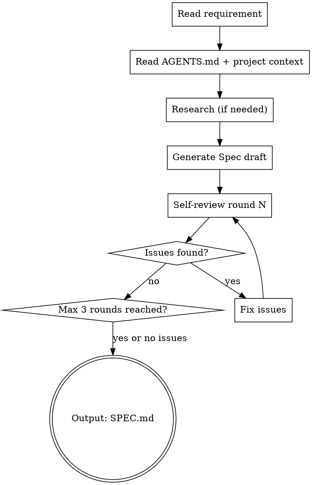

# Autopilot Analyze — 需求分析与 Spec 生成

将模糊的需求转化为精确的技术方案 Spec，并经过多轮自检确保质量。

**宣告**: "正在使用 autopilot-analyze 进行需求分析和 Spec 生成。"

## 输入

- 自然语言需求描述，或
- GitHub Issue URL，或
- 已有的 AGENTS.md / 项目上下文

## Process



### Step 1: 上下文收集

#### Step 1a: 项目配置

```bash
# 读取项目上下文
cat AGENTS.md 2>/dev/null || echo "No AGENTS.md"
cat SPEC.md 2>/dev/null || echo "No existing SPEC.md"
```

#### Step 1b: 代码结构理解（代码本体 = 最高权威）

如果项目配置了代码分析工具（`$CODE_ANALYZER_CMD`）：

```bash
# 获取全局架构（模块布局、入口点、热点函数、文件树）
$CODE_ANALYZER_CMD get_architecture

# 搜索与需求相关的已有代码
$CODE_SEARCH_CMD "需求关键词"

# 追踪关键函数的调用链（如需）
$CODE_ANALYZER_CMD trace_path --function "关键函数名"
```

如果未配置代码分析工具，降级为目录扫描 + 文件读取：

```bash
# 降级方案：目录结构 + 入口文件
ls -la src/ 2>/dev/null || ls -la */src/ 2>/dev/null || echo "No src directory yet"
cat src/index.* src/main.* src/app.* 2>/dev/null || echo "No entry file found"
```

#### Step 1c: 知识库约束（经验沉淀 = 防御红线）

```bash
# 读取知识库（由 evolve 阶段积累，用于减少 Spec 幻觉）
HARNESS_DIR=$(grep -oP 'harness_dir:\s*\K\S+' AGENTS.md 2>/dev/null || echo "harness")
cat $HARNESS_DIR/rules/*.md 2>/dev/null || echo "No rules yet"
cat $HARNESS_DIR/memory/learnings.md 2>/dev/null || echo "No learnings yet"
cat $HARNESS_DIR/knowledge-base.md 2>/dev/null || echo "No knowledge base yet"
```

收集优先级（冲突时以高优先级为准）：
1. **代码本体**（Step 1b）— 实时真相，最高权威
2. **知识库**（Step 1c）— 历史经验，约束红线
3. **项目配置**（Step 1a）— 技术栈和构建命令

### Step 2: 需求调研（可选）

如果需求涉及外部 API 或未知技术：
- 使用 WebSearch 调研最佳实践
- 使用 SearchAgent 查找项目中相关代码

### Step 3: 生成 Spec

**Spec 文件**: 写入项目根目录 `SPEC.md`（或追加章节）

**知识库约束**（如果 Step 1 读取到了 $HARNESS_DIR/knowledge-base.md）:
- Spec 中的技术决策必须与知识库中「已验证的技术决策」保持一致，除非新需求明确要求推翻
- Spec 必须遵守知识库中「必须遵守的编码规则」，在相关设计中显式体现
- Spec 必须规避知识库中「已知坑点」，在设计中主动防御
- Spec 必须满足知识库中「项目约束」

**Spec 必须包含**:
1. 项目概述 + 用户故事
2. 系统架构（文字 + ASCII 图）
3. 数据库设计（完整 DDL）
4. API 设计（RESTful 接口表）
5. 核心代码接口（Java interface / 关键类）
6. 部署方案
7. 里程碑/Phase 规划

### Step 4: 自检循环（2-3轮）

每轮自检维度不同：

| 轮次 | 审查维度 |
|------|---------|
| 第1轮 | 架构合理性、技术可行性、安全性 |
| 第2轮 | 用户体验、部署运维、成本 |
| 第3轮 | 边界情况、扩展性、MVP聚焦度 |

**自检方式**: 使用独立 qodercli worker 做审查：

```bash
# 控制器生成自检 prompt 后调度独立审查实例
$AGENT_DISPATCH --model "$AUTOPILOT_REVIEWER_MODEL" \
  --cwd "$PROJECT_ROOT" \
  --prompt-file /tmp/autopilot-spec-review-N.md \
  --instruction "作为资深架构师审查 SPEC.md，输出 Critical/Major/Minor 分级建议" \
  > /tmp/autopilot-spec-review-N-result.md 2>&1
```

### Step 5: 输出

- 状态: `ANALYZE_STATUS=DONE` 或 `ANALYZE_STATUS=BLOCKED|{原因}`
- 产物: `SPEC.md` 已写入项目根目录
- 自检报告: 输出修复了多少 Critical/Major/Minor 问题

## 约束

- Spec 不超过 800 行（聚焦 MVP）
- 每张数据库表必须有 `ext_info JSON` 扩展字段
- ext_info 内必须包含 traceId
- 不做多用户设计（除非需求明确要求）
