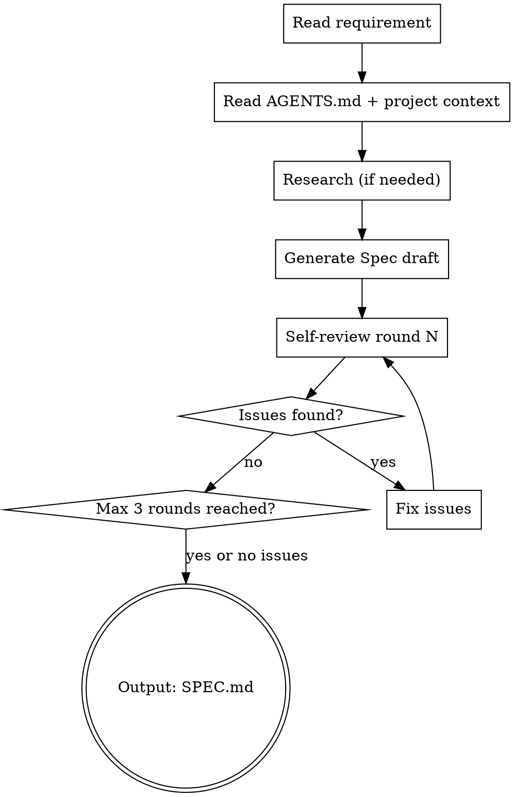

# Autopilot Analyze — 需求分析与 Spec 生成

基于 explore 阶段的澄清结果和知识库约束，生成精确的技术方案 Spec，并经过多轮自检确保质量。

**宣告**: "正在使用 autopilot-analyze 进行 Spec 生成。"

## 输入

- `$CHANGE_DIR/explore-notes.md`（explore 阶段的澄清记录和设计方向）
- `$KNOWLEDGE_DIR/SCHEMA.md`（项目约束 + 设计原则 + 各阶段规则）
- `$KNOWLEDGE_DIR/wiki/index.md`（知识库导航，按需读取相关 wiki 页面）
- AGENTS.md / 项目上下文

## Process



### Step 1: 上下文收集

#### Step 1a: 读取 explore 阶段产出

```bash
# 读取澄清记录（explore 阶段的核心产出）
cat $CHANGE_DIR/explore-notes.md
```

explore-notes.md 包含：项目现状摘要、澄清记录、方案选择、设计方向确认。

#### Step 1b: 读取知识库（三层 Wiki）

```bash
# SCHEMA: 项目约束、设计原则、各阶段规则
cat $KNOWLEDGE_DIR/SCHEMA.md 2>/dev/null || echo "No SCHEMA yet"

# Wiki 导航: 定位相关知识页面
cat $KNOWLEDGE_DIR/wiki/index.md 2>/dev/null || echo "No wiki index yet"

# 按需读取相关 wiki 页面（guides/concepts/entities）
# 例如: cat $KNOWLEDGE_DIR/wiki/guides/backend-rules.md
# 例如: cat $KNOWLEDGE_DIR/wiki/concepts/retry-mechanism.md
```

除本地 wiki 外，同时读取 explore-notes.md 中「## 历史经验命中」段（Step 1a 已读入），并可选再跑一次 `scripts/kb-search.sh` 覆盖全局 KB，把命中的既往决策/坑点作为 Spec 约束纳入（沿用下方收集优先级：explore 产出 > KB 约束 > 项目配置）。

#### Step 1c: 项目配置

```bash
cat AGENTS.md 2>/dev/null || echo "No AGENTS.md"
```

收集优先级（冲突时以高优先级为准）：
1. **explore 产出**（Step 1a）— 用户确认的设计方向，最高权威
2. **知识库约束**（Step 1b）— SCHEMA.md 约束 + wiki 经验
3. **项目配置**（Step 1c）— 技术栈和构建命令

### Step 2: 需求调研（可选）

如果需求涉及外部 API 或未知技术：
- 使用 WebSearch 调研最佳实践
- 使用 SearchAgent 查找项目中相关代码

### Step 3: 生成 Spec

**Spec 文件**: 写入 `$CHANGE_DIR/spec.md`

**知识库约束**（基于 Step 1b 读取的内容）:
- Spec 必须与 SCHEMA.md 中的 `Constraints` 和 `Design Principles` 保持一致
- Spec 必须遵守 SCHEMA.md 中 `Per-Stage Rules / spec` 定义的规则
- Spec 必须规避 wiki/guides/ 和 wiki/concepts/ 中记录的「已知坑点」
- Spec 必须与 explore-notes.md 中确认的设计方向一致

**Spec 必须包含**（按项目形态取用，不假设某语言/框架）:
1. 项目概述 + 用户故事
2. 系统架构（文字 + ASCII 图）
3. 数据模型 / 持久化设计（如涉及；关系型 DB 给出 DDL）
4. 接口设计（API / CLI / 库接口，视项目形态而定）
5. 核心接口 / 类型定义（用项目自身语言表达）
6. 部署方案
7. 里程碑 / Phase 规划
8. 可观测验收（Observable Acceptance）：对每个用户可观测输出值/态给出 SSOT + 不变量 + 蜕变关系（多源值必带判别样例、含空/部分/打架三态）；禁实现口径。先查 KB doctrine 推导，查不到覆盖真歧义才登记 `[NEEDS CLARIFICATION]`。详见 `_shared/observable-acceptance.md`。user-facing 改动缺此段且无可证伪免除 → `ANALYZE_STATUS=BLOCKED|{原因}`

### Step 4: 自检循环（2-3轮）

每轮自检维度不同：

| 轮次 | 审查维度 |
|------|---------|
| 第1轮 | 架构合理性、技术可行性、安全性 |
| 第2轮 | 用户体验、部署运维、成本 |
| 第3轮 | 边界情况、扩展性、MVP聚焦度；可观测验收完备性（多源值有判别性 MR？扰动轴覆盖全部非权威源？SSOT 摆明？实现口径泄漏？——均 WARN 自修不 BLOCK） |

**自检方式**: 档位 A——控制器按 `_shared/conventions.md` 调度模板生成自检 prompt、调度独立审查实例；档位 B——控制器在会话内直接自检（同样 2-3 轮维度）。

## 输出

- 状态: `ANALYZE_STATUS=DONE` 或 `ANALYZE_STATUS=BLOCKED|{原因}`
- 产物: `$CHANGE_DIR/spec.md` 已写入
- 自检报告: 输出修复了多少 Critical/Major/Minor 问题

## 约束

- Spec 不超过 800 行（聚焦 MVP）
- Spec 的技术约束（表结构 / 字段 / 日志追踪等规范）**来自被开发项目自身**（`AGENTS.md` / `SCHEMA.md` / `wiki/guides`），不在此硬编码某语言 / 框架的规则
- 不做多用户设计（除非需求明确要求）

