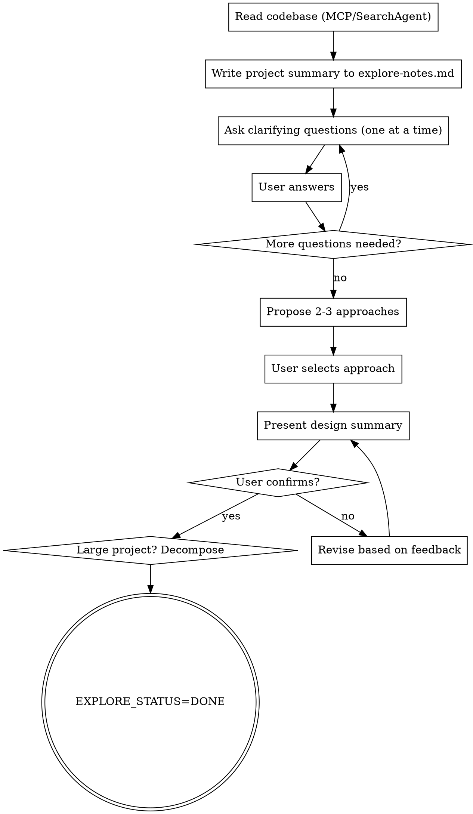

# Autopilot Explore — 需求澄清与设计确认

基于对现有代码的理解，与用户进行多轮交互，澄清需求边界、确认设计方向。
只有用户明确确认设计方向后，才能进入 Spec 生成阶段。

**宣告**: "正在使用 autopilot-explore 进行需求澄清。"

<HARD-GATE>
未获得用户对设计方向的明确确认前，禁止进入 Spec 生成。
即使用户说"直接开始"，也必须至少确认一次核心设计决策——但这次确认**可以是一次复述式确认**（把已澄清的方向浓缩成设计摘要请用户点头），不必强行再抛新问题。
本阶段在控制器会话中执行（因为需要与用户对话），不 spawn qodercli worker。
</HARD-GATE>

## 输入

- 用户的自然语言需求描述，或
- GitHub Issue URL，或
- Bug 描述（bugfix 模式）

## 模式

| 模式 | 触发条件 | 深度 |
|------|---------|------|
| 完整模式 | feature 类型，需求尚模糊 | 全部 5 步 |
| 轻量模式 | bugfix 类型 | 仅 Step 1 + Step 2（确认 bug 范围和修复方向） |
| 已澄清模式 | 需求已在当前交互会话中充分澄清（范围/方案/关键决策都已明确） | 跳过逐一提问，直接 Step 4 呈现设计摘要，请用户**复述式确认一次** |

> 已澄清模式（档位 B 常见）：用户常在进入 explore 前就把范围、方案、约束讲清了。此时**不要为走流程再问一遍**——把已明确的方向写进 explore-notes.md，直接跳到 Step 4 的"设计方向确认"，请用户点头即可；这一次确认仍是强制的（满足 HARD-GATE）。

## Process



### Step 1: 读代码理解现状

使用代码分析工具理解项目当前状态：

```bash
# 如果配置了 CODE_ANALYZER_CMD
$CODE_ANALYZER_CMD get_architecture
$CODE_SEARCH_CMD "需求相关关键词"

# 降级方案：使用 SearchAgent 或目录扫描
# 目标：理解模块边界、关键接口、技术栈、现有功能
```

同时读取知识库获取项目约束：

```bash
cat $KNOWLEDGE_DIR/SCHEMA.md 2>/dev/null || echo "No SCHEMA yet"
cat $KNOWLEDGE_DIR/wiki/index.md 2>/dev/null || echo "No wiki index yet"
```

**历史经验检索**：用需求关键词调用 kb-search.sh（绝对路径，唯一写法见 `_shared/conventions.md`「托管脚本路径」），检索本地 + 全局历史经验：

```bash
"$HOME/.qoder/skills/neil-coding-autopilot/scripts/kb-search.sh" --query "<需求关键词>" --cwd "$PROJECT_ROOT"
```

命中结果写入 explore-notes.md 的「## 历史经验命中」段；**无命中（脚本输出 `(no prior-art hits)`）也必须写该段并注明"无命中"**，不得省略此段。

**产出**: 写入 `$CHANGE_DIR/explore-notes.md`：

```markdown
# Explore Notes

## 项目现状摘要

- 技术栈: [从代码/AGENTS.md 读取]
- 模块结构: [关键模块列表]
- 与需求相关的现有代码: [文件路径 + 简述]
- 技术约束: [从 SCHEMA.md 及 wiki/concepts/ 读取]

## 历史经验命中

[kb-search.sh 的命中结果逐条列出；无命中则写"无命中"]

## 澄清记录

[后续步骤中追加]
```

### Step 2: 提出澄清问题

基于对代码的理解，向用户提出有针对性的问题。

**规则**:
- 一次只问一个问题
- 偏好多选题（降低用户认知负担）
- 问题必须基于代码理解（不是泛泛而问）
- 聚焦：范围边界、技术选型、非功能需求、已有代码的复用/改造

**问题示例**（基于代码理解）:
- "你现有的 auth 模块用的是 JWT + Spring Security，新功能需要跟它对接吗？还是独立的认证体系？"
- "你的 distribution_task 表已经有了 retry 机制，新平台是复用这套还是独立设计？"
- "当前 OSS 配置走 system_config 表，新功能的配置也走这里吗？"

**每个问答追加到 explore-notes.md**:
```markdown
## 澄清记录

### Q1: [问题]
**Answer**: [用户回答]
**决策**: [确定的方向]
```

**bugfix 轻量模式**: 只确认以下问题后即可结束：
1. Bug 的复现路径/触发条件
2. 期望的正确行为
3. 修复范围（是否涉及数据库/API 变更）
4. 若改动用户可观测输出：该值的 SSOT + ≥1 条判别性蜕变关系（见 `_shared/observable-acceptance.md`）

### Step 3: 提出 2-3 个实现方案

当需求边界清晰后，提出可选的实现方案：

**每个方案包含**:
- 方案名称（一句话概括）
- 核心思路（3-5 句）
- 优点
- 缺点/风险
- 工作量估算

**推荐方案标注**: 明确说明推荐哪个方案及理由。

**用户选择后记录到 explore-notes.md**:
```markdown
### 方案选择

| 方案 | 描述 | 评估 |
|------|------|------|
| A | ... | 推荐 ✓ |
| B | ... | 备选 |
| C | ... | 不推荐 |

**用户选择**: 方案 A
**理由**: [用户的补充说明]
```

### Step 4: 呈现设计摘要（用户确认）

综合前面的澄清和方案选择，输出一页纸的设计方向总结：

```markdown
## 设计方向确认

**功能目标**: [一句话]
**实现方案**: [选定的方案名称]
**技术边界**:
- 涉及的模块: [列表]
- 数据库变更: 是/否
- API 变更: 是/否
- 第三方集成: 是/否

**核心设计决策**:
1. [决策1]
2. [决策2]
3. [决策3]

**不做的事情（scope out）**:
- [排除项1]
- [排除项2]
```

**等待用户确认**: 用户说"确认"/"可以"/"go" 后才解锁下一阶段。
如果用户提出修改意见，调整后重新呈现，直到确认。

> 可观测验收（user-facing 改动必附）：对每个用户可观测输出值/态给出 SSOT + 不变量 + 蜕变关系（多源值含判别样例，含空/部分/打架三态）；详见 `_shared/observable-acceptance.md`。

### Step 5: 大项目分解判断

如果需求涉及多个独立子系统：

1. 识别独立的子系统边界
2. 建议拆分为多个 autopilot cycle
3. 确定执行顺序（哪个先做）
4. 本次 explore 只锁定第一个子系统的设计方向

## 输出

- 状态: `EXPLORE_STATUS=DONE` 或 `EXPLORE_STATUS=BLOCKED|{原因}`
- 产物: `$CHANGE_DIR/explore-notes.md` 已写入完整的澄清记录和设计方向
- 摘要: "需求澄清完成，确认方案: [方案名称]，涉及 N 个模块"

## 约束

- 一次一个问题，不要一次抛出多个问题
- 偏好多选题，但开放性问题也可以
- 不在 explore 阶段写任何代码
- 不在 explore 阶段生成 Spec（那是 analyze 的职责）
- explore-notes.md 是 analyze 阶段的输入源之一

## 输出后行为

本阶段完成后报告 `EXPLORE_STATUS=DONE`，控制器按流程图调度下一阶段。
