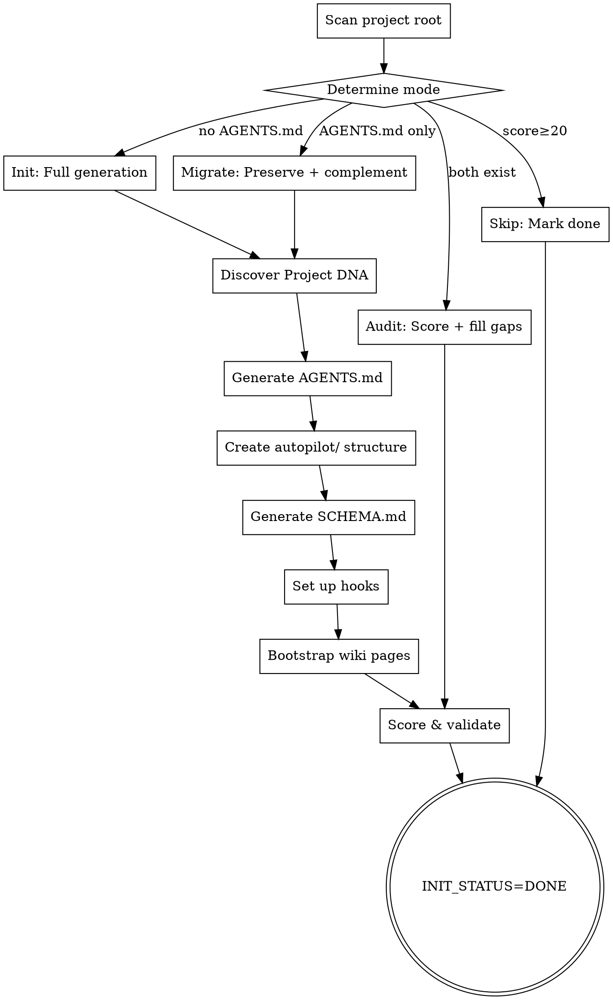

# Autopilot Init — 项目 Harness 初始化

检测目标项目的 AI 协作基础设施完备性，缺失则从零搭建，已有则评分补全。
覆盖"零到一"：让任何裸项目具备被 autopilot 全托管开发的能力。

**宣告**: "正在使用 autopilot-init 初始化项目 Harness。"

<HARD-GATE>
如果项目根目录无 AGENTS.md 且无 autopilot/ 目录，则本阶段为 MANDATORY。
已有完整 harness 的项目可跳过（progress.md 中标记 `[x] init (skipped)`）。
本阶段由 qodercli 独立进程执行（不需要与用户交互）。
</HARD-GATE>

## 模式检测

扫描项目根目录，自动决定模式：

| 条件 | 模式 | 行为 |
|------|------|------|
| 无 AGENTS.md + 无 autopilot/ | **Init** | 全量生成 |
| 有 AGENTS.md + 无 autopilot/ | **Migrate** | 保留 AGENTS.md，补全 autopilot/ 结构 |
| 有 AGENTS.md + 有 autopilot/ | **Audit** | 评分现有质量，补全缺失维度 |
| 有完整 harness（评分≥20/30） | **Skip** | 标记 `init (skipped)` 直接通过 |

## Process



### Step 1: Discover Project DNA

扫描项目提取技术指纹：

```
Check for:
- Package managers: package.json, pom.xml, build.gradle, go.mod, requirements.txt, Cargo.toml
- Framework markers: src/main/java (Spring), src/app (Next.js), cmd/ (Go), app/ (Rails)
- Build tools: Maven wrapper, Gradle wrapper, Makefile, Dockerfile
- Existing tooling: .eslintrc, checkstyle.xml, .editorconfig, prettier.config
- CI/CD: .github/workflows/, .gitlab-ci.yml, Jenkinsfile
- Existing docs: README.md, SPEC.md, docs/, CONTRIBUTING.md
- Git conventions: last 20 commit messages → style inference
- Test framework: jest.config, pytest.ini, src/test/java
- Existing harness: .harness/, .qoder/, .cursorrules, .ai/
```

**产出**: 内部工作变量（不落盘），驱动后续步骤的模板选择。

### Step 2: Generate AGENTS.md

**核心约束**（来自 ETH Zurich 研究）:
- 60-150 行 MAX，每行必须有价值
- 是 **INDEX** 不是手册，指向 `autopilot/knowledge/wiki/` 获取细节
- 五个核心段落：Identity, Tech Stack, Commands, Doc Navigation, Critical Rules
- 提及的 Tools/Commands 被 Agent 使用概率提升 160x

**模板**:

```markdown
# [Project Name]

> [One-line description]

## Tech Stack

| Layer | Technology |
|-------|-----------|
| Backend | [Language + Framework + ORM] |
| Frontend | [Framework + Build tool] |
| Database | [DB] |
| External | [APIs, services] |

## Commands

```bash
# Build
[build command]

# Test
[test command]

# Lint
[lint command]

# Run
[start command]
```

## Documentation

| Doc | Purpose | Link |
|-----|---------|------|
| Knowledge Wiki | AI-compiled project knowledge | [-> view](autopilot/knowledge/wiki/index.md) |
| Schema | KB maintenance rules + metadata | [-> view](autopilot/knowledge/SCHEMA.md) |
| Hooks | Quality gates (build/lint) | [-> view](autopilot/hooks/) |

## Critical Rules

1. [从代码推断的最重要规则]
2. [第二重要]
3. [...]

## Warnings

- **[关键警告]**: [原因]
```

**Migrate 模式**: 保留现有 AGENTS.md 内容，仅补充 Doc Navigation 指向 `autopilot/`。

### Step 3: Create autopilot/ Directory Structure

```bash
mkdir -p autopilot/changes
mkdir -p autopilot/archive
mkdir -p autopilot/knowledge/raw
mkdir -p autopilot/knowledge/wiki/{entities,concepts,guides,comparisons}
mkdir -p autopilot/knowledge/references
mkdir -p autopilot/hooks
```

**完整目录树**:

```
autopilot/
├── changes/                      # 活跃开发变更（per-run）
├── archive/                      # 已完成的历史变更
├── knowledge/                    # Karpathy LLM Wiki 三层知识库
│   ├── SCHEMA.md                 # 维护规则 + 项目元数据（≤200行）
│   ├── raw/                      # Layer 1: 不可变源（CR发现/踩坑/代码快照）
│   │   └── {YYYYMMDD-slug}.md
│   ├── wiki/                     # Layer 2: LLM 编译产物
│   │   ├── index.md              # 全局导航（always-on，每次会话必读）
│   │   ├── inbox.md              # 来源状态机（pending/processing/done）
│   │   ├── log.md                # 操作时间线（append-only）
│   │   ├── entities/             # 实体页（模块概览/组件职责）
│   │   ├── concepts/             # 概念页（设计原则/架构决策）
│   │   ├── guides/               # 指南页（编码规则/操作指南）
│   │   └── comparisons/          # 对比页（方案 A vs B）
│   └── references/               # 静态框架性内容
├── hooks/                        # 质量门禁（Feedback/Sensor Layer）
│   ├── post-edit.sh              # 变更后自动检查
│   ├── build-gate.sh             # 编译验证
│   └── pre-completion.md         # 完成前自检清单
└── (docs/ 已合并入 knowledge/wiki/entities/)
```

### Step 4: Generate SCHEMA.md

```markdown
---
project_type: <Codebase | Document | Hybrid>
scale_tier: <small | medium | large | xlarge>
domain: "<从代码推断的项目领域>"
primary_language: <Java | TypeScript | Python | Go | Rust>
created: YYYY-MM-DD
updated: YYYY-MM-DD
---

# Knowledge Base Schema

> Auto-generated by autopilot-init. Maintained by autopilot-evolve.
> ≤ 200 行。本文件告诉 Agent 如何维护本知识库。

## Project Metadata

- name: <project name>
- tech_stack: <detected tech stack>
- deployment: <detected from CI/CD or Dockerfile>

## Constraints (项目约束)

- <从现有代码推断的约束 1>
- <约束 2>

## Design Principles (设计原则)

- <从代码风格推断的原则 1>

## Per-Stage Rules (各阶段规则)

### explore
- 确认需求前检查现有模块边界

### spec
- Spec 必须引用 SCHEMA.md 中的 Constraints

### tasks
- 每个 Task 必须有独立的验证命令

## Wiki Categories (分类约定)

| Category | 存放内容 | 示例 |
|----------|---------|------|
| entities/ | 模块/组件/服务概览 | distributor-server.md |
| concepts/ | 设计决策/架构原则 | retry-mechanism.md |
| guides/ | 编码规则/操作指南 | backend-rules.md |
| comparisons/ | 方案对比分析 | acr-vs-ghcr.md |

## Ingest Rules (写入规则)

- 先写 raw/，再编译到 wiki/
- 单次 ingest ≤ 15 页更新（防雪崩）
- 每次 ingest 后必须更新 wiki/index.md
- 无来源不写（回写门禁）
- 纯推理标注 [inferred]，矛盾标注 [disputed]

## Lint Schedule (健康检查)

- 每 5 次 evolve 后建议执行 lint
- 检查项：矛盾检测 / 过时检测 / 孤立页 / 缺页 / 断链
```

### Step 5: Set Up Hooks (Quality Gates)

**5a. post-edit.sh** — 变更后自动运行：

```bash
#!/bin/bash
# autopilot/hooks/post-edit.sh
# Runs after code changes. Exit 0 = pass, non-zero = fail.

# Auto-detected lint/format command
[detected_lint_command]  # e.g., mvn checkstyle:check / npm run lint / cargo clippy

# Exit code propagation
exit $?
```

**5b. build-gate.sh** — 编译验证：

```bash
#!/bin/bash
# autopilot/hooks/build-gate.sh
# Verifies project compiles. Called by autopilot-loop verify step.

[detected_build_command]  # e.g., mvn compile -q / npm run build / cargo build

exit $?
```

**5c. pre-completion.md** — Agent 自检清单：

```markdown
# Pre-Completion Checklist

Before declaring a task "done", verify:
- [ ] Code compiles without errors (`autopilot/hooks/build-gate.sh` passes)
- [ ] All existing tests still pass
- [ ] New code has corresponding tests (if applicable)
- [ ] No dead code or debug prints left behind
- [ ] AGENTS.md updated if architecture changed
- [ ] No hardcoded secrets or credentials
```

### Step 6: Generate Initial Wiki Pages

基于 Project DNA 生成首批 wiki 页面：

**6a. wiki/guides/ — 编码规则类**

根据检测到的技术栈生成对应的 guide 页面：

```markdown
---
created: YYYY-MM-DD
updated: YYYY-MM-DD
type: guide
evidence: derived
---

# [Domain] Coding Rules

## [Rule Name]
**Do**: [正确做法 + 代码示例]
**Don't**: [错误做法 + 代码示例]
**Self-check**: [Agent 如何自验]
```

生成策略：
- Java/Spring → `wiki/guides/backend-rules.md`
- React/Next.js → `wiki/guides/frontend-rules.md`
- Database → `wiki/guides/database-rules.md`
- 通用 → `wiki/guides/general-rules.md`

**6b. wiki/entities/ — 模块概览类**

对每个识别出的模块生成实体页：

```markdown
---
created: YYYY-MM-DD
updated: YYYY-MM-DD
type: module-overview
module: <module-name>
evidence: derived
---

# <Module Name> — 模块概览

## 职责（一句话）

## 边界
### 做什么
- ...
### 不做什么
- ...（由 [[other-module]] 负责）

## 对外接口
| 接口 | 类型 | 说明 |
|------|------|------|

## 核心依赖
- [[dep-module]] — 依赖原因
```

**6c. wiki/concepts/ — 架构决策类（可选，仅当代码中发现显著设计决策时生成）**

### Step 7: Generate wiki/index.md + inbox.md + log.md

**wiki/index.md**（全局导航，always-on，Agent 每次会话必读）：

```markdown
# Knowledge Wiki Index

> Auto-maintained by autopilot-evolve. Agent 每次会话读取本文件定位知识。

## Entities（模块/组件）

- [[module-name]] — 一句话描述

## Concepts（架构决策）

## Guides（编码规则/指南）

- [[backend-rules]] — Java/Spring 编码规则

## Comparisons（对比分析）
```

**wiki/inbox.md**（来源状态机）：

```markdown
# Inbox — 待处理队列

## Pending

## Processing

## Done
```

**wiki/log.md**（操作时间线）：

```markdown
# 操作日志

| 日期 | 操作 | 详情 |
|------|------|------|
| YYYY-MM-DD | Init | 项目类型: X / 规模: Y / 生成 N 页 |
```

### Step 8: Score & Validate (Audit Checklist)

对所有模式（含 Init 完成后）执行 6 维评分：

| Dimension | Score (0-5) | Key Check |
|-----------|-------------|-----------|
| AGENTS.md Quality | | 60-150 行 + Index 风格 + Commands |
| Feedforward: Rules | | 独立文件 + Do/Don't + Self-check |
| Feedforward: Docs | | Architecture map + Progressive disclosure |
| Feedback: Hooks | | post-edit + build-gate + pre-completion |
| Feedback: Tests & Lint | | Lint 命令可用 + Test 命令可用 |
| Context Engineering | | SCHEMA.md + wiki/index.md + raw→wiki 流程 |

**评分解读**:

| Total (X/30) | Grade | 行为 |
|--------------|-------|------|
| 0-10 | D/F | Init 模式必须执行 |
| 11-15 | C | 补全缺失维度 |
| 16-19 | B | 输出改进建议，不强制 |
| 20-30 | A/S | Skip，直接通过 |

**Audit 模式补全逻辑**: 对每个评分<3的维度，自动生成缺失产物。

## 旧约定迁移

如果检测到旧的知识库结构，自动迁移：

```
# 旧平铺模式 → 三层 Wiki
context.yaml         → SCHEMA.md frontmatter (合并)
learnings.md         → raw/YYYYMMDD-learnings-migration.md (作为原始源)
knowledge-base.md    → 删除（wiki/ 本身就是编译产物）
rules/*.md           → wiki/guides/ (迁移为 guide 页面)

# 旧 harness 目录
.harness/rules/      → raw/ + wiki/guides/ (ingest)
.harness/docs/       → raw/ + wiki/entities/ (ingest)
.harness/hooks/      → autopilot/hooks/ (move)
.harness/lessons/    → raw/ (as 原始源)
.qoder/rules/        → raw/ + wiki/guides/ (ingest)
.cursorrules         → 内容合并入 AGENTS.md + raw/
```

迁移后在 `wiki/log.md` 追加迁移记录。

## 输出

- 状态: `INIT_STATUS=DONE` 或 `INIT_STATUS=SKIPPED`
- 评分: "Harness Score: X/30 (Grade: Y)"
- 产物清单: "生成: AGENTS.md + autopilot/{hooks,knowledge}"
- 摘要: "项目 [name] harness 初始化完成，评分 X/30，可进入 explore 阶段"

## 约束

- AGENTS.md 绝不超过 150 行（Init 生成时严格控制）
- 不覆盖用户已有的 AGENTS.md（Migrate 模式只补充 navigation）
- 不删除任何现有文件（只新建或追加）
- hooks 必须可执行（`chmod +x`）
- SCHEMA.md 初始内容基于代码推断，不凭空编造
- SCHEMA.md 不超过 200 行
- wiki 页面必须有 frontmatter（created/updated/type/evidence）
- 单次 ingest 不超过 15 页更新
