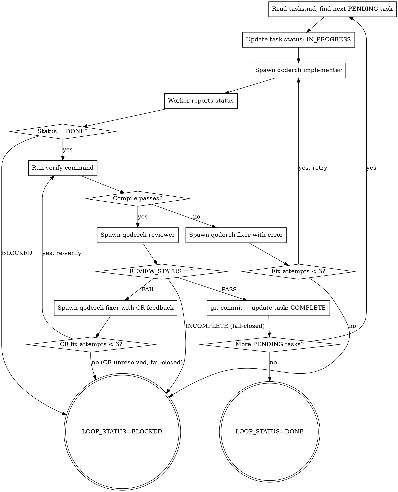

# Autopilot Loop — 双层 Loop 执行器

Outer Loop 遍历 Task 列表，Inner Loop 对每个 Task 执行 implement → compile → review → fix 循环。
每个工人是独立的 qodercli 进程，context 完全隔离，模型可分别配置。

**宣告**: "正在使用 autopilot-loop 执行开发循环。"

## 输入

> **loop 的开发两档都经 `run-track-a.sh` 托管 qodercli**（控制器不内联写码）。控制器进 loop 前确保 `tasks.md` 就绪（小 spec 可 1 Task），然后 `bash run-track-a.sh --change-dir $CHANGE_DIR --cwd $PROJECT_ROOT`；下列描述其内部循环。

- `$CHANGE_DIR/tasks.md`（由 autopilot-plan 生成）
- 验证命令（从 tasks.md 头部读取）

## 前置：分支纪律门（fail-closed）

**开始实现任何 Task 前，先自检当前分支**（HARD-GATE #2 / `_shared/conventions.md`「分支纪律」）。在**被开发项目的仓库**里执行（非 plugin 仓库）：

```bash
CUR="$(git rev-parse --abbrev-ref HEAD 2>/dev/null || echo '')"
case "$CUR" in
  main|master)
    # init 若未切分支（如 spec-ready 快路径）→ 现在补切，禁止在主干落代码
    git checkout -b "<type>/<feature-name>" || { echo "BLOCKED: 无法切功能分支"; exit 1; }
    ;;
esac
```

> 这是「实现前自检点」，兜底 init 分支准备被跳过的情况。**引用方在任何项目跑 autopilot，都不会在 main/master 上直接落代码。**

## Architecture

```
Outer Loop (你，控制器 - 当前会话):
  遍历 tasks.md 中的每个 Task
  ├─ 控制 Task 进度
  ├─ 调度 qodercli worker 执行
  ├─ 验证编译结果
  ├─ 调度 qodercli reviewer 做 CR
  └─ 更新 tasks.md 状态

Inner Loop (qodercli worker，独立进程):
  执行单个 Task
  ├─ 实现代码
  ├─ 自检
  └─ 报告状态后退出
```

> 上面 Architecture 与下面 digraph 是 `run-track-a.sh` 的内部循环（**两档通用**）。差异只在谁启动它：档位 A 从终端起、端到端无人值守；档位 B 由控制器在会话内 `bash run-track-a.sh ...` 启动、只看日志摘要。控制器（两档）都不内联写码——逐项映射见 `_shared/conventions.md` 档位适配表。

## 模型配置

通过环境变量或 tasks.md 头部配置：

```bash
# 默认配置（可在 tasks.md 头部或环境变量中覆盖）
AUTOPILOT_IMPLEMENTER_MODEL="Performance"    # 编码型，快速生成
AUTOPILOT_REVIEWER_MODEL="Ultimate"          # 推理型，深度审查
AUTOPILOT_FIXER_MODEL="Performance"          # 编码型，快速修复
```

## Process



## 控制器行为规则

> 先按 `_shared/conventions.md` **档位适配表**确定"怎么做"；下列规则（不变量）两档都适用。

1. **开发一律托管** — 两档的 implement/review/fix 都由 `run-track-a.sh` spawn fresh qodercli worker 执行；控制器不内联写码（见适配表）
2. **验证是强制的** — 每个 Task 完成后必须跑验证命令
3. **CR 是强制的** — 验证通过后必须审查，结果按 `REVIEW_STATUS`（三态，见 conventions）处理
4. **CR 结果 fail-closed** — `PASS`→commit；`FAIL`→fixer（≤3 轮，仍未过 → BLOCKED）；`INCOMPLETE`→**不 commit、不推进、BLOCKED 上报**。绝不 force-commit 未过审代码
5. **状态记录** — Task 级状态由 `run-track-a.sh` 写进 tasks.md（两档）；控制器用 progress.md（A）/ TodoWrite（B）追踪阶段级
6. **失败快速** — 连续 3 次失败即 BLOCKED，不无限重试

## 档位 B（交互）：控制器启动 run-track-a.sh 托管 loop

档位 B 的 loop **不再由控制器内联执行**，而是同样交给 `run-track-a.sh`——控制器只负责启动它、读日志摘要、把结果转达用户：

```bash
# 控制器进 loop 前：确保 tasks.md 就绪（小 spec 可 1 Task，见 autopilot-plan）
RUNNER="$(dirname "$DISPATCH")/run-track-a.sh"   # 与 dispatch.sh 同目录（$DISPATCH 解析见 conventions）
bash "$RUNNER" --change-dir "$CHANGE_DIR" --cwd "$PROJECT_ROOT"   # --dry-run 先看计划
```

- 脚本逐 Task 跑 implement→verify→review→fix→commit（每步 fresh qodercli），fail-closed（退出码 0=全 DONE / 2=BLOCKED）。
- 控制器**不读源文件、不写代码、不看 diff**——开发细节全在 worker 的独立 context。
- 退出码 2 → 读该 Task 的 driver 日志摘要，向用户报告 BLOCKED 原因（人工介入 / 缩小 Task / 调整 spec），**不 force-commit**。
- 跑完控制器在会话内继续 finish/evolve。

安全阀（内建于 run-track-a.sh）：单 Task `--max-rounds`（默认 3）review→fix 轮数上限；implement/commit 失败或轮数耗尽 → BLOCKED（fail-closed），绝不误标 DONE。

## 控制器 context 卫生

**开发托管后，控制器 context 不再随开发膨胀**——读文件 / 写码 / 测试迭代 / 大 diff 全在 worker 的独立 context 里，控制器只留 prompt + 日志摘要 + 状态行。这正是"开发一律托管 qodercli"的首要收益（依据：Anthropic《Context Engineering》的 subagent offload 策略）。

控制器自身只剩**编排级** context（阶段进度 + 与用户的对话）。仅当 Task 数极多、编排对话本身过长时才需兜底：
- **落盘 memory**：tasks.md（Task 级，run-track-a.sh 已维护）+ progress.md（阶段级）作为跨会话记忆。
- **换会话续跑（compaction）**：开新会话读 tasks.md/progress.md 从下一个 PENDING 继续，或用 `run-track-a.sh --resume` 跳过已 DONE 的 Task。

## qodercli Worker 调度

所有 worker 均按 `_shared/conventions.md` 中的调度模板执行，差异仅在 prompt 文件内容：

| Worker 类型 | Prompt 模板来源 | 模型环境变量 |
|------------|-----------------|------------------|
| Implementer | `./implementer-prompt.md`（实现模板） | AUTOPILOT_IMPLEMENTER_MODEL |
| Reviewer | `../autopilot-review/reviewer-prompt.md` | AUTOPILOT_REVIEWER_MODEL |
| Fixer | `./implementer-prompt.md`（修复模板） | AUTOPILOT_FIXER_MODEL |

控制器根据模板填充变量后写入 `/tmp/autopilot-task-N-{type}.md`，再按约定模板调度。

## Git Commit 规范

Task 级 commit 由 `run-track-a.sh` 自动完成（verify + CR 通过后，每 Task 一个 commit，消息形如 `autopilot(track-a): Task N — [title]`）。脚本区分"无变更"与"真失败（hook/签名/index）"——真失败 → BLOCKED，绝不误标 DONE（fail-closed）。

## 输出

- 状态: `LOOP_STATUS=DONE` 或 `LOOP_STATUS=BLOCKED|Task N: {原因}`
- 产物: `$CHANGE_DIR/tasks.md` 中所有 Task 状态已更新
- 汇总: "N/M Tasks 完成，共 X 轮迭代"

## 并行执行（可选）

当 tasks.md 中多个 Task 标记 `Depends: none` 时，控制器可并行调度：

1. 检测当前 PENDING 中无依赖的 Task 子集
2. 为每个并行 task 创建 worktree: `git worktree add /tmp/task-N-wt`
3. 并行启动 N 个 worker（每个在独立 worktree）
4. 等待全部完成后合并回主分支
5. 对合并结果运行 verify + review

约束：
- 最大并行度: $AUTOPILOT_MAX_PARALLEL（默认 3）
- 合并冲突 → 降级串行执行冲突的 task
- 并行 task 的 review 各自独立

## 人工确认门禁

当 Task 标记 `Gate: human` 时，implement + verify 完成后暂停：

1. 输出变更摘要（文件列表 + diff 统计）
2. 等待用户输入：
   - `continue` → 继续 review + commit
   - `abort` → BLOCKED
   - `retry with: <修改指令>` → 重新执行 implement
3. 只有收到 `continue` 后才进入 review 阶段

## 验证命令变量约定

所有验证相关命令从 `$CHANGE_DIR/tasks.md` 头部解析，控制器进入 loop 前必须完成：

| 变量 | tasks.md 头部字段 | 必选 |
|------|------------------|------|
| $VERIFY_CMD | `Verify command: ...` | 是 |
| $TEST_CMD | `Test command: ...` | 否 |
| $RUNTIME_START_CMD | `Runtime start: ...` | 否 |
| $RUNTIME_VERIFY_CMD | `Runtime verify: ...` | 否 |
| $HEALTH_CHECK_URL | `Health check URL: ...` | 否 |
| $RUNTIME_STOP_CMD | `Runtime stop: ...` | 否 |

若某层级缺失（如无测试命令），则只执行已定义的层级。

## 验证层级

| 层级 | 方式 | 使用条件 |
|------|------|--------|
| L1: 编译 | $VERIFY_CMD（编译/lint） | 所有 Task（必选） |
| L2: 测试 | $TEST_CMD（jest/pytest/mvn test） | 有测试的 Task |
| L3: 运行时 | $RUNTIME_VERIFY_CMD | Task 标记 Runtime Verify 时 |

L3 Runtime Verification 流程：
1. `$RUNTIME_START_CMD` 启动服务
2. 等待 `$HEALTH_CHECK_URL` 返回 200
3. 执行 `$RUNTIME_VERIFY_CMD`（如 curl 测 API）
4. `$RUNTIME_STOP_CMD` 停止服务
5. 退出码非零 → FAIL

> 验证层级是**项目形状相关**的：只有服务型项目才有 L3 health-check；CLI / cron / 库 类项目通常只有 L1（+L2），不要硬套 health-check URL 模型（缺失即跳过，不算缺陷）。

