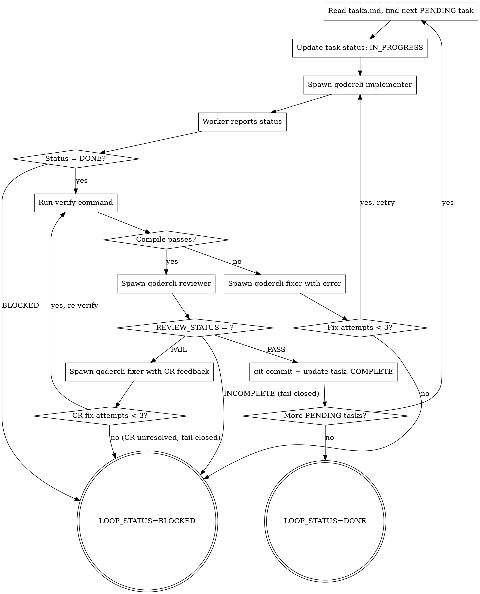

# Autopilot Loop — 双层 Loop 执行器

Outer Loop 遍历 Task 列表，Inner Loop 对每个 Task 执行 implement → compile → review → fix 循环。
每个工人是独立的 qodercli 进程，context 完全隔离，模型可分别配置。

**宣告**: "正在使用 autopilot-loop 执行开发循环。"

## 输入

> 执行前先按 `_shared/conventions.md` **档位适配表**确定档位；下列为档位 A 形态，档位 B 的 Task 列表来自 TodoWrite、验证命令由控制器确定。

- `$CHANGE_DIR/tasks.md`（由 autopilot-plan 生成）
- 验证命令（从 tasks.md 头部读取）

## Architecture

```
Outer Loop (你，控制器 - 当前会话):
  遍历 tasks.md 中的每个 Task
  ├─ 控制 Task 进度
  ├─ 调度 qodercli worker 执行
  ├─ 验证编译结果
  ├─ 调度 qodercli reviewer 做 CR
  └─ 更新 tasks.md 状态

Inner Loop (qodercli worker，独立进程):
  执行单个 Task
  ├─ 实现代码
  ├─ 自检
  └─ 报告状态后退出
```

> 上面 Architecture 与下面 digraph 描述**档位 A**（spawn worker）。**档位 B** 走同一套 Outer/Inner 循环与判定，但控制器在会话内直接实现、以 TodoWrite 记录 Task 状态——逐项映射见 `_shared/conventions.md` 档位适配表。

## 模型配置

通过环境变量或 tasks.md 头部配置：

```bash
# 默认配置（可在 tasks.md 头部或环境变量中覆盖）
AUTOPILOT_IMPLEMENTER_MODEL="Performance"    # 编码型，快速生成
AUTOPILOT_REVIEWER_MODEL="Ultimate"          # 推理型，深度审查
AUTOPILOT_FIXER_MODEL="Performance"          # 编码型，快速修复
```

## Process



## 控制器行为规则

> 先按 `_shared/conventions.md` **档位适配表**确定"怎么做"；下列规则（不变量）两档都适用。

1. **执行机制随档位** — 档位 A：所有实现经 qodercli worker；档位 B：控制器在会话内直接实现（见适配表），不 spawn worker
2. **验证是强制的** — 每个 Task 完成后必须跑验证命令
3. **CR 是强制的** — 验证通过后必须审查，结果按 `REVIEW_STATUS`（三态，见 conventions）处理
4. **CR 结果 fail-closed** — `PASS`→commit；`FAIL`→fixer（≤3 轮，仍未过 → BLOCKED）；`INCOMPLETE`→**不 commit、不推进、BLOCKED 上报**。绝不 force-commit 未过审代码
5. **状态记录随档位** — 档位 A 更新 tasks.md，档位 B 更新 TodoWrite
6. **失败快速** — 连续 3 次失败即 BLOCKED，不无限重试

## 档位 B（交互）执行

控制器在会话内直接执行同一套循环（Ralph 五步）：**Pick → Implement → Validate → Commit → Next**。
- **Pick**：从 TodoWrite 取下一个 PENDING Task
- **Implement**：控制器直接改代码（不 spawn worker）
- **Validate**：跑 $VERIFY_CMD（+ 测试 / 运行时，按需）
- **Commit**：验证 + CR 通过后提交；CR 非 PASS 按 fail-closed 处理（见规则 4）
- **Next**：TodoWrite 标 COMPLETE，进入下一 Task

安全阀（两档通用，防打转）：
- `MAX_ITERATIONS`（默认 8）：单 Task 迭代上限
- **重试前反思**：修复前先自问「上次为什么失败？这次具体改什么？是否在重复同一无效做法？」
- 卡 3 轮同一错误 → 停手上报（档位 A：kill + reassign 新 worker；档位 B：BLOCKED 通知用户）

## 档位 B context 预算兜底

档位 B 全程单一连续 context，长任务会 context 膨胀（context rot：token 越多、召回越差）。控制器须自我监测并兜底：

**触发启发式**（任一满足）：已完成 Task ≥ 6、单轮迭代明显偏长、或明显感到“上下文变重 / 开始丢失早期决定”。

**兜底动作**：
1. **落盘**（此时档位 B 也必须写）：把已完成 / 剩余 Task 与关键决定写入 `$CHANGE_DIR/tasks.md` + `progress.md`，作为跨会话记忆。
2. **续跑二选一**：
   - **换新会话续跑（推荐 = compaction）**：开新会话读 tasks.md/progress.md 从下一个 PENDING 继续；或用 qodercli 原生会话续跑 `qodercli -c`（接最近会话）/ `-r <id>`（按 id 恢复）/ `--fork-session`（从摘要派生新会话）。
   - **切 Track A / 局部 offload（= subagent）**：把剩余重活（大文件实现 / 大 diff 审查）交给 headless worker——经 `scripts/dispatch.sh` 起一次性 `qodercli -p`，只回传摘要，主会话 context 不涨。
3. 需显式限窗时，worker 侧可加 `qodercli --context-window <size>`。

> 依据：Anthropic《Context Engineering》——长任务用 compaction（摘要重启）/ memory（外部落盘）/ subagent（独立 context）三策略。本项目 memory 层 = tasks.md/progress.md；compaction/subagent 由 qodercli 原生 `--fork-session`/`-r` 与 dispatch.sh 提供。

## qodercli Worker 调度

所有 worker 均按 `_shared/conventions.md` 中的调度模板执行，差异仅在 prompt 文件内容：

| Worker 类型 | Prompt 模板来源 | 模型环境变量 |
|------------|-----------------|------------------|
| Implementer | `./implementer-prompt.md`（实现模板） | AUTOPILOT_IMPLEMENTER_MODEL |
| Reviewer | `../autopilot-review/reviewer-prompt.md` | AUTOPILOT_REVIEWER_MODEL |
| Fixer | `./implementer-prompt.md`（修复模板） | AUTOPILOT_FIXER_MODEL |

控制器根据模板填充变量后写入 `/tmp/autopilot-task-N-{type}.md`，再按约定模板调度。

## Git Commit 规范

每个 Task 完成后（由控制器执行，不是 worker）：
```bash
git add -A
git commit -m "feat(task-N): [task name]"
```

## 输出

- 状态: `LOOP_STATUS=DONE` 或 `LOOP_STATUS=BLOCKED|Task N: {原因}`
- 产物: `$CHANGE_DIR/tasks.md` 中所有 Task 状态已更新
- 汇总: "N/M Tasks 完成，共 X 轮迭代"

## 并行执行（可选）

当 tasks.md 中多个 Task 标记 `Depends: none` 时，控制器可并行调度：

1. 检测当前 PENDING 中无依赖的 Task 子集
2. 为每个并行 task 创建 worktree: `git worktree add /tmp/task-N-wt`
3. 并行启动 N 个 worker（每个在独立 worktree）
4. 等待全部完成后合并回主分支
5. 对合并结果运行 verify + review

约束：
- 最大并行度: $AUTOPILOT_MAX_PARALLEL（默认 3）
- 合并冲突 → 降级串行执行冲突的 task
- 并行 task 的 review 各自独立

## 人工确认门禁

当 Task 标记 `Gate: human` 时，implement + verify 完成后暂停：

1. 输出变更摘要（文件列表 + diff 统计）
2. 等待用户输入：
   - `continue` → 继续 review + commit
   - `abort` → BLOCKED
   - `retry with: <修改指令>` → 重新执行 implement
3. 只有收到 `continue` 后才进入 review 阶段

## 验证命令变量约定

所有验证相关命令从 `$CHANGE_DIR/tasks.md` 头部解析，控制器进入 loop 前必须完成：

| 变量 | tasks.md 头部字段 | 必选 |
|------|------------------|------|
| $VERIFY_CMD | `Verify command: ...` | 是 |
| $TEST_CMD | `Test command: ...` | 否 |
| $RUNTIME_START_CMD | `Runtime start: ...` | 否 |
| $RUNTIME_VERIFY_CMD | `Runtime verify: ...` | 否 |
| $HEALTH_CHECK_URL | `Health check URL: ...` | 否 |
| $RUNTIME_STOP_CMD | `Runtime stop: ...` | 否 |

若某层级缺失（如无测试命令），则只执行已定义的层级。

## 验证层级

| 层级 | 方式 | 使用条件 |
|------|------|--------|
| L1: 编译 | $VERIFY_CMD（编译/lint） | 所有 Task（必选） |
| L2: 测试 | $TEST_CMD（jest/pytest/mvn test） | 有测试的 Task |
| L3: 运行时 | $RUNTIME_VERIFY_CMD | Task 标记 Runtime Verify 时 |

L3 Runtime Verification 流程：
1. `$RUNTIME_START_CMD` 启动服务
2. 等待 `$HEALTH_CHECK_URL` 返回 200
3. 执行 `$RUNTIME_VERIFY_CMD`（如 curl 测 API）
4. `$RUNTIME_STOP_CMD` 停止服务
5. 退出码非零 → FAIL

> 验证层级是**项目形状相关**的：只有服务型项目才有 L3 health-check；CLI / cron / 库 类项目通常只有 L1（+L2），不要硬套 health-check URL 模型（缺失即跳过，不算缺陷）。

