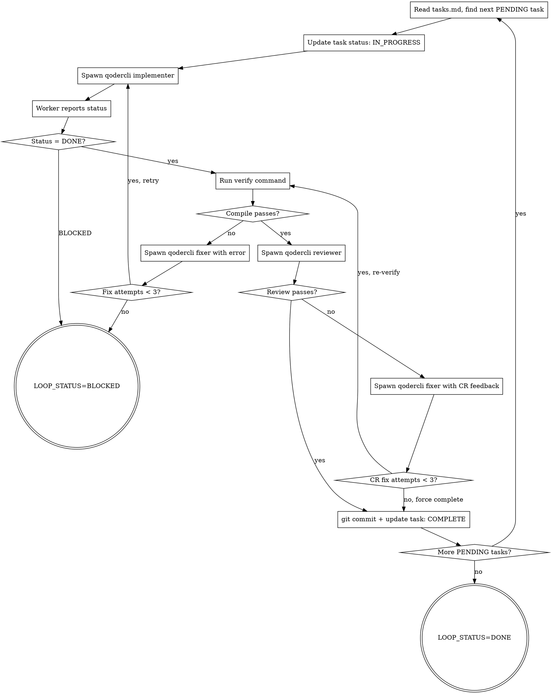

# Autopilot Loop — 双层 Loop 执行器

Outer Loop 遍历 Task 列表，Inner Loop 对每个 Task 执行 implement → compile → review → fix 循环。
每个工人是独立的 qodercli 进程，context 完全隔离，模型可分别配置。

**宣告**: "正在使用 autopilot-loop 执行开发循环。"

## 输入

- `tasks.md` 文件（由 autopilot-plan 生成）
- 验证命令（从 tasks.md 头部读取）

## Architecture

```
Outer Loop (你，控制器 - 当前会话):
  遍历 tasks.md 中的每个 Task
  ├─ 控制 Task 进度
  ├─ 调度 qodercli worker 执行
  ├─ 验证编译结果
  ├─ 调度 qodercli reviewer 做 CR
  └─ 更新 tasks.md 状态

Inner Loop (qodercli worker，独立进程):
  执行单个 Task
  ├─ 实现代码
  ├─ 自检
  └─ 报告状态后退出
```

## 模型配置

通过环境变量或 tasks.md 头部配置：

```bash
# 默认配置（可在 tasks.md 头部或环境变量中覆盖）
AUTOPILOT_IMPLEMENTER_MODEL="Performance"    # 编码型，快速生成
AUTOPILOT_REVIEWER_MODEL="Ultimate"          # 推理型，深度审查
AUTOPILOT_FIXER_MODEL="Performance"          # 编码型，快速修复
```

## Process



## 控制器行为规则

1. **不亲自写代码** — 所有实现通过 qodercli worker 完成
2. **验证是强制的** — 每个 Task 完成后必须跑验证命令
3. **CR 是强制的** — 编译通过后必须调度 reviewer
4. **状态落盘** — 每个 Task 完成/失败后更新 tasks.md
5. **失败快速** — 连续 3 次失败即 BLOCKED，不无限重试

## qodercli 调度方式

### Implementer Worker

```bash
# 将 prompt 写入临时文件
cat > /tmp/autopilot-task-N-prompt.md << 'EOF'
[填充后的实现模板内容]
EOF

$AGENT_DISPATCH --model "$AUTOPILOT_IMPLEMENTER_MODEL" \
  --cwd "$PROJECT_ROOT" \
  --prompt-file /tmp/autopilot-task-N-prompt.md \
  --instruction "执行附件中描述的开发任务" \
  > /tmp/autopilot-task-N-result.md 2>&1
```

Prompt 文件内容由控制器根据 `./implementer-prompt.md` 模板 + Task 描述生成。

### Reviewer Worker

```bash
cat > /tmp/autopilot-task-N-review-prompt.md << 'EOF'
[填充后的 review 模板内容]
EOF

$AGENT_DISPATCH --model "$AUTOPILOT_REVIEWER_MODEL" \
  --cwd "$PROJECT_ROOT" \
  --prompt-file /tmp/autopilot-task-N-review-prompt.md \
  --instruction "执行附件中描述的 Code Review 任务" \
  > /tmp/autopilot-task-N-review-result.md 2>&1
```

Prompt 文件内容由控制器根据 `../autopilot-review/reviewer-prompt.md` 模板 + diff 生成。

### Fixer Worker

```bash
cat > /tmp/autopilot-task-N-fix-prompt.md << 'EOF'
[填充后的修复模板内容]
EOF

$AGENT_DISPATCH --model "$AUTOPILOT_FIXER_MODEL" \
  --cwd "$PROJECT_ROOT" \
  --prompt-file /tmp/autopilot-task-N-fix-prompt.md \
  --instruction "执行附件中描述的修复任务" \
  > /tmp/autopilot-task-N-fix-result.md 2>&1
```

Prompt 文件内容由控制器根据 `./implementer-prompt.md`（修复模板）+ 错误信息生成。

## Git Commit 规范

每个 Task 完成后（由控制器执行，不是 worker）：
```bash
git add -A
git commit -m "feat(task-N): [task name]"
```

## 输出

- 状态: `LOOP_STATUS=DONE` 或 `LOOP_STATUS=BLOCKED|Task N: {原因}`
- 产物: tasks.md 中所有 Task 状态已更新
- 汇总: "N/M Tasks 完成，共 X 轮迭代"

## 并行执行（可选）

当 tasks.md 中多个 Task 标记 `Depends: none` 时，控制器可并行调度：

1. 检测当前 PENDING 中无依赖的 Task 子集
2. 为每个并行 task 创建 worktree: `git worktree add /tmp/task-N-wt`
3. 并行启动 N 个 worker（每个在独立 worktree）
4. 等待全部完成后合并回主分支
5. 对合并结果运行 verify + review

约束：
- 最大并行度: $AUTOPILOT_MAX_PARALLEL（默认 3）
- 合并冲突 → 降级串行执行冲突的 task
- 并行 task 的 review 各自独立

## 人工确认门禁

当 Task 标记 `Gate: human` 时，implement + verify 完成后暂停：

1. 输出变更摘要（文件列表 + diff 统计）
2. 等待用户输入：
   - `continue` → 继续 review + commit
   - `abort` → BLOCKED
   - `retry with: <修改指令>` → 重新执行 implement
3. 只有收到 `continue` 后才进入 review 阶段

## 验证层级

| 层级 | 方式 | 使用条件 |
|------|------|--------|
| L1: 编译 | $VERIFY_CMD（编译/lint） | 所有 Task（必选） |
| L2: 测试 | $TEST_CMD（jest/pytest/mvn test） | 有测试的 Task |
| L3: 运行时 | $RUNTIME_VERIFY_CMD | Task 标记 Runtime Verify 时 |

L3 Runtime Verification 流程：
1. `$RUNTIME_START_CMD` 启动服务
2. 等待 `$HEALTH_CHECK_URL` 返回 200
3. 执行 `$RUNTIME_VERIFY_CMD`（如 curl 测 API）
4. `$RUNTIME_STOP_CMD` 停止服务
5. 退出码非零 → FAIL
