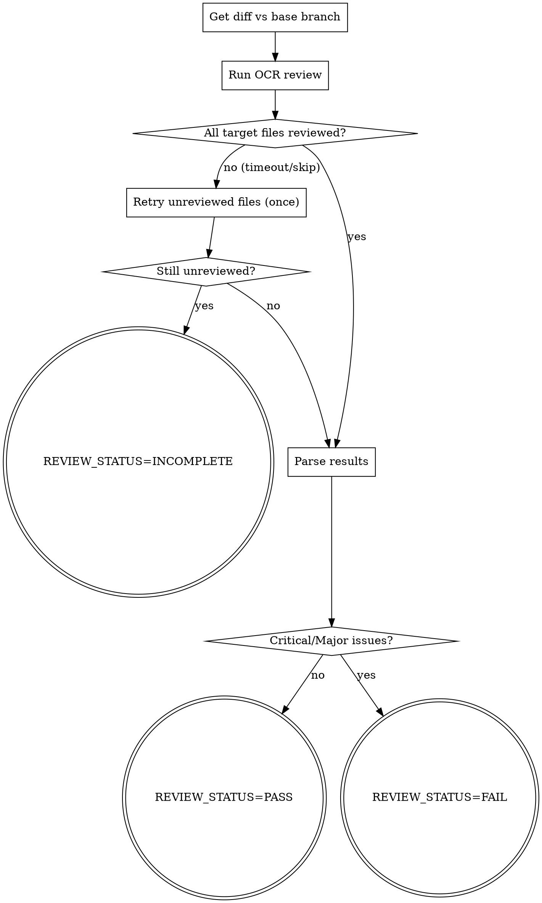

# Autopilot Review — Code Review 执行器

使用 OCR（OpenCodeReview）CLI 对当前 Task 的代码变更进行自动化审查。

**宣告**: "正在使用 autopilot-review 执行 Code Review。"

## 前置条件

- OCR CLI 已安装并配置（`ocr` 命令可用）
- DashScope API Key 已配置（`DASHSCOPE_API_KEY` 环境变量）
- 当前分支有未合并的 commit

## Process



### Step 1: 获取变更 Diff

先自适应主干分支名（仓库可能是 `master` 或 `main`），再取「本分支相对主干」的全部变更源码文件，**不写死语言类型**：

```bash
# 自适应主干分支：origin/HEAD → 回退 main → 回退 master
BASE=$(git symbolic-ref refs/remotes/origin/HEAD 2>/dev/null | sed 's@^refs/remotes/origin/@@')
[ -z "$BASE" ] && BASE=$(git rev-parse --verify -q main >/dev/null && echo main || echo master)

git diff "$BASE"... --stat

# 取所有变更源码文件（排除锁文件/生成物/二进制），不限定某语言后缀
git diff "$BASE"... --name-only \
  | grep -Ev '(\.lock$|\.min\.|\.map$|/vendor/|/node_modules/|/dist/|/build/|/target/)' \
  > /tmp/review-files.txt
```

### Step 2: 执行 OCR Review

```bash
# 对整个 diff 做 review（推荐）
git diff "$BASE"... > /tmp/task-diff.patch
ocr review --diff /tmp/task-diff.patch
```

如果 `ocr` 命令不可用，降级使用 qodercli reviewer（按 `_shared/conventions.md` 中的调度模板，使用 `./reviewer-prompt.md` 作为 prompt 模板，`{FILES_CHANGED_LIST}` 填 `/tmp/review-files.txt`）。

### Step 3: 超时/未审文件兜底（关键）

审查工具（OCR 或 LLM reviewer）可能对**单个文件超时或跳过**（`context deadline exceeded` / skipped）。绝不能把"未审 = 通过"。

1. **核对覆盖率**：对比 `/tmp/review-files.txt` 与 OCR 实际覆盖的文件，找出未被审查的文件。
2. **重试一次**：仅对未审文件重跑（`ocr review --files "<未审文件>"`，或降级 reviewer 单独审这些文件）。
3. **仍未审 → INCOMPLETE**：重试后仍有文件未被审查时，**不得报告 PASS**。报告 `REVIEW_STATUS=INCOMPLETE` 并列出未审文件，交由控制器决定（人工审 / 缩小 diff 再审 / 显式豁免）。核心原则：**未经审查的变更不能静默通过。**

### Step 4: 解析结果

- 有 CRITICAL / MAJOR 问题 → `REVIEW_STATUS=FAIL`，返回问题列表
- 有文件未被审查（Step 3 未能消解）→ `REVIEW_STATUS=INCOMPLETE`
- 全部文件已审 且 只有 MINOR / 无问题 → `REVIEW_STATUS=PASS`

## 输出

- 状态: `REVIEW_STATUS=PASS` | `REVIEW_STATUS=FAIL` | `REVIEW_STATUS=INCOMPLETE`
- 如果 FAIL：返回需要修复的具体问题列表（含文件路径和行号）
- 如果 INCOMPLETE：列出未被审查的文件 + 原因
- autopilot-loop 收到 FAIL 后调度 fixer worker 修复；收到 INCOMPLETE 时不得进入 finish

## Review 维度

审查维度分两层：**通用维度**（任何语言都查）+ **项目特定维度**（从目标项目自身规范读取，不写死某语言）。

### 通用维度（语言无关）

1. **安全**: 注入（SQL/命令/模板）、XSS/CSRF、硬编码密钥、不安全的反序列化、缺失的权限/输入校验
2. **逻辑**: 空值/空集合、边界与条件遗漏、并发竞态、错误被吞、资源未释放
3. **健壮性**: 外部调用无超时/重试/兜底、失败无日志、编码/编解码边界
4. **性能**: N+1、无界查询、同步阻塞 IO、大对象常驻内存
5. **可维护性**（Minor）: 命名、函数过长、死代码、注释与实现不符

### 项目特定维度（从目标项目读取，不硬编码）

审查前先读取目标项目的规范来源（存在才读），把其中的**强制规则**作为 Major 检查项：

- `AGENTS.md`（关键约束 / 编码规则）
- `autopilot/knowledge/SCHEMA.md`（Constraints / Design Principles）
- `autopilot/knowledge/wiki/guides/*`（编码规则页）

> 例：某 Java 项目在 SCHEMA 里要求"每张表 ext_info 写 traceId"→ 作为该项目的 Major 项；某 Python 项目要求"文件 I/O 必须 encoding=utf-8"→ 作为该项目的 Major 项。**规则来自被审项目，不来自本 skill。**

## 约束

- 最多循环 3 轮 CR（防止无限修复）
- MINOR 问题不阻塞流程（记录但不强制修复）
- **未审文件不得静默 PASS**（见 Step 3，报 INCOMPLETE）
- OCR 不可用时自动降级到 qodercli reviewer
