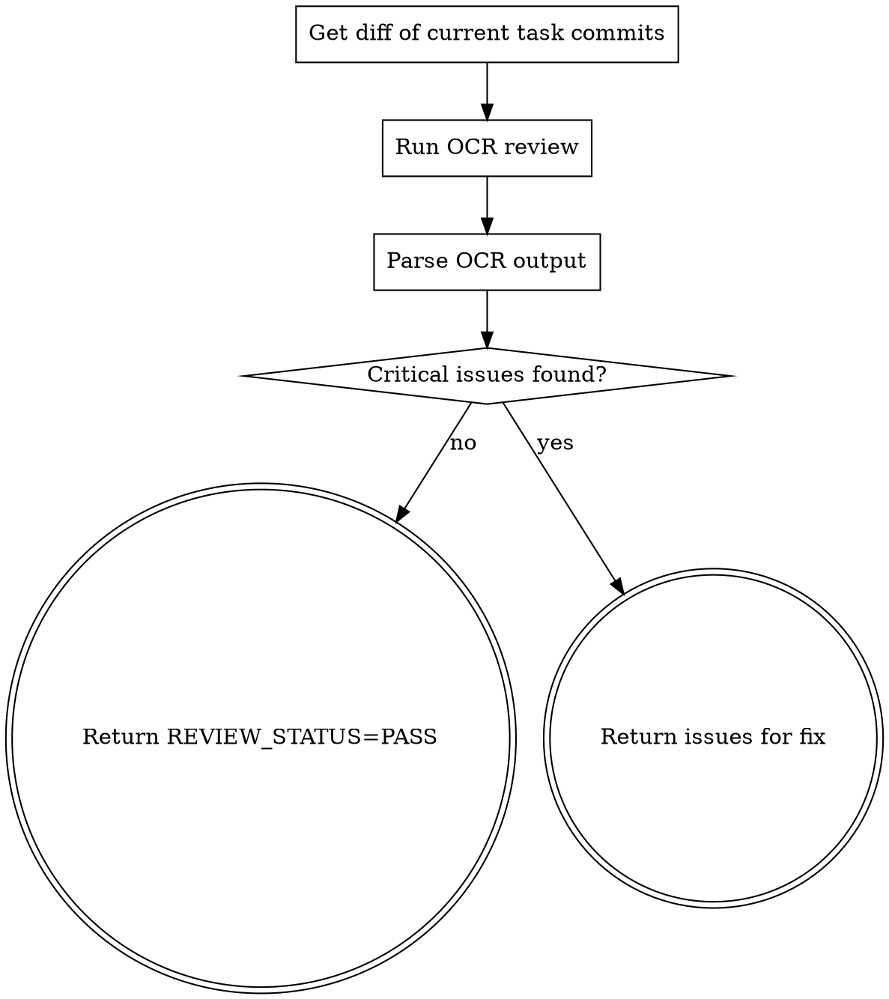

# Autopilot Review — Code Review 执行器

使用 OCR（OpenCodeReview）CLI 对当前 Task 的代码变更进行自动化审查。

**宣告**: "正在使用 autopilot-review 执行 Code Review。"

## 前置条件

- OCR CLI 已安装并配置（`ocr` 命令可用）
- DashScope API Key 已配置（`DASHSCOPE_API_KEY` 环境变量）
- 当前分支有未合并的 commit

## Process



### Step 1: 获取变更 Diff

```bash
# 获取当前 Task 的变更（相对于 main 分支）
git diff main --stat
git diff main -- '*.java' '*.xml' '*.yml' '*.sql'
```

### Step 2: 执行 OCR Review

```bash
# 方式1: 对最近N个commit做review
ocr review --last-commits 1

# 方式2: 对指定文件做review
ocr review --files "path/to/changed/file1.java,path/to/changed/file2.java"

# 方式3: 对整个diff做review（推荐）
git diff main > /tmp/task-diff.patch
ocr review --diff /tmp/task-diff.patch
```

如果 `ocr` 命令不可用，降级使用 qodercli reviewer 做 review：

```bash
# 控制器生成 review prompt 后调度独立 reviewer 实例
$AGENT_DISPATCH --model "$AUTOPILOT_REVIEWER_MODEL" \
  --cwd "$PROJECT_ROOT" \
  --prompt-file /tmp/autopilot-task-N-review-prompt.md \
  --instruction "执行附件中描述的 Code Review 任务" \
  > /tmp/autopilot-task-N-review-result.md 2>&1
```

Prompt 模板见 `./reviewer-prompt.md`。

### Step 3: 解析结果

- 有 CRITICAL 问题 → `REVIEW_STATUS=FAIL`，返回问题列表
- 只有 MINOR 问题 → `REVIEW_STATUS=PASS`
- 无问题 → `REVIEW_STATUS=PASS`

## 输出

- 状态: `REVIEW_STATUS=PASS` 或 `REVIEW_STATUS=FAIL`
- 如果 FAIL：返回需要修复的具体问题列表（含文件路径和行号）
- autopilot-loop 收到 FAIL 后会调度 fixer worker 修复

## Review 重点维度

1. **安全**: SQL注入、XSS、硬编码密钥、不安全的反序列化
2. **逻辑**: NPE、空集合操作、条件遗漏、并发问题
3. **规范**: ext_info 未写入 traceId、异常被吞、大文件未流式处理
4. **性能**: N+1查询、内存泄漏、同步阻塞IO

## 约束

- 最多循环 3 轮 CR（防止无限修复）
- MINOR 问题不阻塞流程（记录但不强制修复）
- OCR 不可用时自动降级到 qodercli reviewer
