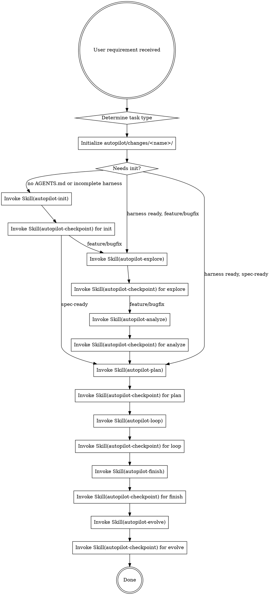

# Neil Coding Autopilot

AI 全托管开发编排器。从需求到部署的全自动开发流水线。

<HARD-GATE>
当用户要求开发一个功能或执行 spec 时，必须满足以下**不变量**（无论用哪种执行档位）：
1. 需求澄清（explore）：动手前确认边界与设计方向，不臆测。
2. 分支纪律：功能分支开发，不直接在主干写。
3. Code Review：改动完成后必须经过 CR（autopilot-review），未审不得进入 finish。
4. 验证：合并 / 部署前跑通验证命令（编译 / 测试 / 自检）。
5. 知识沉淀（evolve）：把 CR 发现的规律与踩坑写回知识库。
6. 状态可追溯：进度写入 `progress.md`（档位 A），或以 TodoWrite 为单一状态源（档位 B）——不靠记忆。

**HARD-GATE 约束的是"必须发生什么"（不变量），不是"用哪种机制"（见「执行档位」）。**
</HARD-GATE>

## 触发条件

以下任一条件满足即触发 autopilot 流程：
- 用户说"跑 autopilot""全自动""从需求到部署""AI 全托管"
- 用户说"开发 spec.md""按照 spec 开发""实现 spec"
- GitHub Issue 标记 `autonomous` label
- 用户提了一个功能需求且期望 AI 端到端完成

## 执行档位（Execution Tracks）

同一套流程有两种执行方式。**先判断档位，再执行**——用错档位会让机制空转（例如声称在跑批处理，实际只在单 context 内联做）。

| 档位 | 何时用 | 执行机制 | 状态源 | tasks.md / checkpoint-skill / worker 进程 |
|------|--------|---------|--------|------------------------------------------|
| **A · 批处理 (Autonomous)** | 无人值守 / CI / 大型多 Task 构建 / 需要 context 隔离与分模型 | 控制器经 `scripts/dispatch.sh` 为每阶段/Task **spawn 独立 qodercli 进程**（context 隔离、各配模型） | `progress.md`（落盘） | 全部使用 |
| **B · 交互 (Interactive)** | 会话内协作 / 中小改动 / 单一连续 context | 控制器（当前交互 agent）**在会话内直接实现**，不 spawn worker | **TodoWrite（单一状态源）** + 变更目录 `spec.md` | 精简：不 spawn worker、可不写 tasks.md、用 TodoWrite 代替 checkpoint-skill |

**判定规则**：
- 用户在交互会话里发起、期望边做边看 / 随时插话 → **档位 B**。
- 用户要求"无人值守跑完 / headless / 后台批量 / 每阶段不同模型" → **档位 A**。
- 拿不准 → 默认 **B**：强行 spawn 一个无法与用户交互的 worker 只会降质。

**两档都必须满足上面 HARD-GATE 的全部不变量。** 档位只决定 *怎么做*，不决定 *是否做* explore / CR / verify / evolve。

> 设计自省：档位 A 的多进程编排依赖 `scripts/dispatch.sh` 作为确定性驱动；当它由交互 agent 读 SKILL 手动驱动时，实际落到档位 B。**不要假装在跑 A 却只做了 B**——显式声明当前档位，并对该档位诚实履约。
>
> **交互调用 `/using-neil-autopilot` ⇒ 档位 B ⇒ 无 qodercli 级 context 隔离**（编排器 context 会随任务增长）。要真正跑 **Track A（多进程隔离 + 分角色模型）**，必须由顶层 **headless** agent 驱动：
>
> ```bash
> # 顶层 headless 编排器（它再循环调 scripts/dispatch.sh 逐 Task spawn worker）
> qodercli -p "以档位 A 跑 autopilot：按 tasks.md 逐个 spawn worker" -w "$PROJECT_ROOT"
> # 或常驻：qodercli --remote-control <id>
> ```
>
> **前置**：`dispatch.sh` 的超时依赖 `timeout`/`gtimeout`（macOS 需 `brew install coreutils`；缺失时自动降级为无超时，见 dispatch.sh）。跑 Track A 前先用 `bash scripts/smoke-dispatch.sh` 冒烟自检（不烧 token）。

## 任务类型分流

| 类型 | 判断条件 | 流程 |
|------|---------|------|
| new-project | 新项目/无 AGENTS.md | init → explore → analyze → plan → loop → finish → evolve |
| feature | 新功能/用户说"新增" | init(条件) → explore → analyze → plan → loop → finish → evolve |
| bugfix | 用户说"修复/fix/bug" + 已有代码 | init(条件) → explore(轻量) → analyze(轻量) → plan → loop → finish → evolve |
| spec-ready | 用户提供了 spec 或说"按照 spec" | init(条件) → plan → loop → finish → evolve（跳过 explore + analyze） |

bugfix 类型走轻量 analyze（仅生成最小化 spec：bug 范围 + 修复方向 + 验证方法）。
spec-ready 类型将 explore 和 analyze 都标记为 `[x] ... (skipped)`。
init 阶段在项目已有完整 harness 时标记为 `[x] init (skipped)`。

## 目录结构

autopilot 的所有产物统一管理在项目根目录的 `autopilot/` 下（**完整形态**如下；实际**按需生长**，`autopilot-init` 不预建空目录 / 空状态机文件）：

```
autopilot/
├── changes/                      # 活跃的开发变更（每次 run 一个文件夹）
│   └── <feature-name>/           # 如 add-user-registration/
│       ├── spec.md               # 本次变更的技术方案
│       ├── tasks.md              # Task 拆解（档位 A；档位 B 可用 TodoWrite 代替）
│       ├── progress.md           # 工作流状态（档位 A）
│       └── explore-notes.md      # 澄清阶段的对话记录摘要
│
├── archive/                      # 已完成的历史变更
│   └── YYYY-MM-DD-<feature>/     # 如 2026-07-06-video-distributor/
│       ├── spec.md
│       ├── tasks.md
│       └── summary.md            # 完成摘要
│
├── knowledge/                    # Karpathy LLM Wiki 三层知识库
│   ├── SCHEMA.md                 # 维护规则 + 项目元数据（≤200行）
│   ├── raw/                      # Layer 1: 不可变源（CR/踩坑/代码快照）
│   ├── wiki/                     # Layer 2: LLM 编译产物（index + entities/concepts/guides/comparisons）
│   └── references/               # 静态框架性内容
│
└── hooks/                        # 质量门禁（Feedback/Sensor Layer）
    ├── post-edit.sh              # 变更后自动检查
    ├── build-gate.sh             # 编译验证
    └── pre-completion.md         # 完成前自检清单
```

## 初始化流程

执行任何阶段前，先建立变更目录：

```bash
FEATURE_NAME="<feature-name>"   # 从需求提取的 kebab-case 标识
mkdir -p autopilot/changes/${FEATURE_NAME}
```

- **档位 A**：写 `progress.md`（下方模板）作为落盘状态源。
- **档位 B**：以 TodoWrite 为状态源；`progress.md` 可选。

知识库（`autopilot/knowledge/**`）与 hooks 目录**不在此处预建空目录**——由 `autopilot-init` 按需生长（缺什么建什么），避免留下空壳。

progress.md 模板（档位 A / 需要落盘时）：

```bash
cat > autopilot/changes/${FEATURE_NAME}/progress.md << 'EOF'
# Autopilot Progress

> Auto-maintained by autopilot workflow. Do not edit manually.
> Feature: [feature name]
> Branch: [branch name]
> Started: YYYY-MM-DD HH:mm

- [ ] init
- [ ] explore
- [ ] analyze
- [ ] plan
- [ ] loop
- [ ] finish
- [ ] evolve
EOF
```

替换 `[feature name]`、`[branch name]`、`YYYY-MM-DD HH:mm` 为实际值。

**向下兼容**：如果项目根目录存在旧的 SPEC.md/tasks.md/.autopilot/，首次运行时提示用户归档到 `autopilot/archive/`。

## 完整流程

> 下图是**档位 A（批处理）**的完整编排。**档位 B（交互）** 走同样的阶段顺序与不变量，但由控制器在会话内直接执行，用 TodoWrite 记录阶段状态，checkpoint 以"自查前置不变量"替代 skill 调用。



## 使用方式

```
# 有现成 spec 的项目
/neil-coding-autopilot "按照 spec.md 开发整个项目"

# 从需求开始
/neil-coding-autopilot "添加用户注册功能，支持邮箱和手机号"

# GitHub Issue 驱动
/neil-coding-autopilot --issue https://github.com/user/repo/issues/42

# Bug 修复（轻量 explore + 跳过 analyze）
/neil-coding-autopilot "修复登录页面 token 过期未刷新的问题"
```

## Skill 调用规则

### 通用（两档都适用）
1. 先声明当前**执行档位**（A 批处理 / B 交互）。
2. 不得跳过 **explore**（需求澄清强制）。
3. 不得跳过 **CR**（autopilot-review；未审变更不得进入 finish）。
4. 不得跳过 **evolve**（知识沉淀强制）。
5. 任何 skill / worker 报告 **BLOCKED** → 停止流程并通知用户。

### 档位 A（批处理）
- 用 `Skill` tool 或 `scripts/dispatch.sh` 逐阶段调度独立进程。
- 每阶段完成后调用 `Skill("autopilot-checkpoint")` 校验前置并标记 `progress.md`。
- 阶段间完成状态以 `progress.md` 为唯一事实源。
- checkpoint 返回 FAIL → 停止流程并通知用户。

### 档位 B（交互）
- 控制器在会话内直接完成各阶段，**TodoWrite 为单一状态源**。
- 以"自查前置不变量"替代 checkpoint-skill 调用；中小改动可不写 tasks.md（用 TodoWrite 列 Task）。
- 仍需在变更目录落盘 `spec.md`（设计留痕）；`progress.md` 可选。

**路由职责完全在控制器**：各 skill 只报告状态，不负责调度下一阶段。
详细约定见 `_shared/conventions.md`。

## 路径约定

详见 `_shared/conventions.md`。控制器在调度时确定具体值：

| 变量 | 含义 |
|------|------|
| $CHANGE_DIR | 当前变更目录 |
| $KNOWLEDGE_DIR | 知识库目录 |
| $HOOKS_DIR | 质量门禁目录 |
| $ARCHIVE_DIR | 归档目录 |

## 恢复机制

如果流程因中断需要恢复：

1. 检查 `autopilot/changes/` 下是否有活跃的变更目录
2. 读取其 `progress.md`（档位 A）或 TodoWrite 状态（档位 B）确定最后完成的阶段
3. 从下一个未完成阶段继续执行
4. 不重复已完成的阶段
