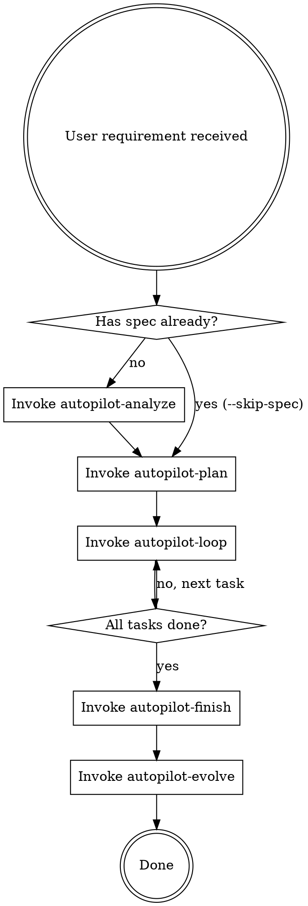

# Neil Coding Autopilot

AI 全托管开发编排器。从需求到部署的全自动开发流水线。

<HARD-GATE>
当用户要求开发一个功能或执行spec时，必须按照下方流程执行。不得跳过任何阶段。
</HARD-GATE>

## 触发条件

以下任一条件满足即触发 autopilot 流程：
- 用户说"跑 autopilot""全自动""从需求到部署""AI 全托管"
- 用户说"开发 spec.md""按照 spec 开发""实现 spec"
- GitHub Issue 标记 `autonomous` label
- 用户提了一个功能需求且期望 AI 端到端完成

## 完整流程



## 使用方式

```
# 有现成 spec 的项目
/neil-coding-autopilot "按照 spec.md 开发整个项目"

# 从需求开始
/neil-coding-autopilot "添加用户注册功能，支持邮箱和手机号"

# GitHub Issue 驱动
/neil-coding-autopilot --issue https://github.com/user/repo/issues/42
```

## Skill 调用规则

1. 按流程图顺序依次调用每个 skill
2. 每个 skill 完成后检查输出状态
3. 如果任何 skill 报告 BLOCKED，停止流程并通知用户
4. 不得跳过 autopilot-review（CR 是强制的）
5. 不得跳过 autopilot-evolve（知识沉淀是强制的）
