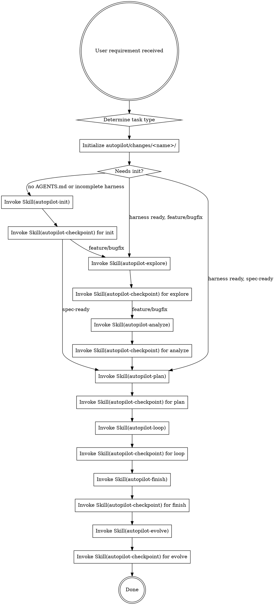

# Neil Coding Autopilot

AI 全托管开发编排器。从需求到部署的全自动开发流水线。

<HARD-GATE>
当用户要求开发一个功能或执行spec时，必须按照下方流程执行。不得跳过任何阶段。
所有阶段完成状态必须落盘到 autopilot/changes/<name>/progress.md，不依赖内存判断。
</HARD-GATE>

## 触发条件

以下任一条件满足即触发 autopilot 流程：
- 用户说"跑 autopilot""全自动""从需求到部署""AI 全托管"
- 用户说"开发 spec.md""按照 spec 开发""实现 spec"
- GitHub Issue 标记 `autonomous` label
- 用户提了一个功能需求且期望 AI 端到端完成

## 目录结构

autopilot 的所有产物统一管理在项目根目录的 `autopilot/` 下：

```
autopilot/
├── changes/                      # 活跃的开发变更（每次 run 一个文件夹）
│   └── <feature-name>/           # 如 add-user-registration/
│       ├── spec.md               # 本次变更的技术方案
│       ├── tasks.md              # Task 拆解
│       ├── progress.md           # 工作流状态
│       └── explore-notes.md      # 澄清阶段的对话记录摘要
│
├── archive/                      # 已完成的历史变更
│   └── YYYY-MM-DD-<feature>/     # 如 2026-07-06-video-distributor/
│       ├── spec.md
│       ├── tasks.md
│       └── summary.md            # 完成摘要
│
├── knowledge/                    # Karpathy LLM Wiki 三层知识库
│   ├── SCHEMA.md                 # 维护规则 + 项目元数据（≤200行）
│   ├── raw/                      # Layer 1: 不可变源（CR/踩坑/代码快照）
│   │   └── {YYYYMMDD-slug}.md
│   ├── wiki/                     # Layer 2: LLM 编译产物
│   │   ├── index.md              # 全局导航（always-on）
│   │   ├── inbox.md              # 来源状态机
│   │   ├── log.md                # 操作时间线
│   │   ├── entities/             # 模块/组件概览
│   │   ├── concepts/             # 设计原则/架构决策
│   │   ├── guides/               # 编码规则/操作指南
│   │   └── comparisons/          # 对比分析
│   └── references/               # 静态框架性内容
│
└── hooks/                        # 质量门禁（Feedback/Sensor Layer）
    ├── post-edit.sh              # 变更后自动检查
    ├── build-gate.sh             # 编译验证
    └── pre-completion.md         # 完成前自检清单
```

## 任务类型分流

| 类型 | 判断条件 | 流程 |
|------|---------|------|
| new-project | 新项目/无 AGENTS.md | init → explore → analyze → plan → loop → finish → evolve |
| feature | 新功能/用户说“新增” | init(条件) → explore → analyze → plan → loop → finish → evolve |
| bugfix | 用户说“修复/fix/bug” + 已有代码 | init(条件) → explore(轻量) → analyze(轻量) → plan → loop → finish → evolve |
| spec-ready | 用户提供了 spec 或说“按照 spec” | init(条件) → plan → loop → finish → evolve（跳过 explore + analyze） |

bugfix 类型走轻量 analyze（仅生成最小化 spec：bug 范围 + 修复方向 + 验证方法）。
spec-ready 类型将 explore 和 analyze 都标记为 `[x] ... (skipped)`。
init 阶段在项目已有完整 harness 时标记为 `[x] init (skipped)`。

## 初始化流程

在执行任何阶段前，**必须先初始化变更目录和工作流状态文件**：

```bash
# 确定 feature name（从需求中提取简短标识符，kebab-case）
FEATURE_NAME="<feature-name>"

# 创建变更目录
mkdir -p autopilot/changes/${FEATURE_NAME}
mkdir -p autopilot/knowledge/raw
mkdir -p autopilot/knowledge/wiki/{entities,concepts,guides,comparisons}
mkdir -p autopilot/knowledge/references
mkdir -p autopilot/hooks
mkdir -p autopilot/archive

# 初始化 progress.md
cat > autopilot/changes/${FEATURE_NAME}/progress.md << 'EOF'
# Autopilot Progress

> Auto-maintained by autopilot workflow. Do not edit manually.
> Feature: [feature name]
> Branch: [branch name]
> Started: YYYY-MM-DD HH:mm

- [ ] init
- [ ] explore
- [ ] analyze
- [ ] plan
- [ ] loop
- [ ] finish
- [ ] evolve
EOF
```

替换 `[feature name]`、`[branch name]`、`YYYY-MM-DD HH:mm` 为实际值。

**向下兼容**：如果项目根目录存在旧的 SPEC.md/tasks.md/.autopilot/，首次运行时提示用户归档到 `autopilot/archive/`。

## 完整流程



## 使用方式

```
# 有现成 spec 的项目
/neil-coding-autopilot "按照 spec.md 开发整个项目"

# 从需求开始
/neil-coding-autopilot "添加用户注册功能，支持邮箱和手机号"

# GitHub Issue 驱动
/neil-coding-autopilot --issue https://github.com/user/repo/issues/42

# Bug 修复（轻量 explore + 跳过 analyze）
/neil-coding-autopilot "修复登录页面 token 过期未刷新的问题"
```

## Skill 调用规则

1. 使用 `Skill` tool 显式调用每个子 skill
2. 每个 skill 完成后，立即调用 `Skill("autopilot-checkpoint")` 验证并标记完成
3. 如果 checkpoint 返回 FAIL，停止流程并通知用户
4. 如果任何 skill 报告 BLOCKED，停止流程并通知用户
5. init 阶段可根据项目状态跳过
6. 不得跳过 autopilot-explore（需求澄清是强制的）
7. 不得跳过 autopilot-review（CR 在 loop 内部执行）
8. 不得跳过 autopilot-evolve（知识沉淀是强制的）
9. 阶段间完成状态以 `progress.md` 为唯一事实源

**路由职责完全在控制器**：各 skill 只报告状态，不负责调度下一阶段。
详细约定见 `_shared/conventions.md`。

## 路径约定

详见 `_shared/conventions.md`。控制器在调度时确定具体值：

| 变量 | 含义 |
|------|------|
| $CHANGE_DIR | 当前变更目录 |
| $KNOWLEDGE_DIR | 知识库目录 |
| $HOOKS_DIR | 质量门禁目录 |
| $ARCHIVE_DIR | 归档目录 |

## 恢复机制

如果流程因中断需要恢复：

1. 检查 `autopilot/changes/` 下是否有活跃的变更目录
2. 读取其中的 `progress.md` 确定最后完成的阶段
3. 从下一个未完成阶段继续执行
4. 不重复已完成的阶段
