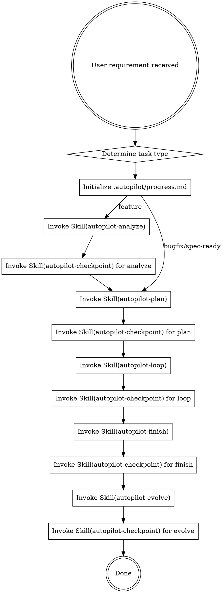

# Neil Coding Autopilot

AI 全托管开发编排器。从需求到部署的全自动开发流水线。

<HARD-GATE>
当用户要求开发一个功能或执行spec时，必须按照下方流程执行。不得跳过任何阶段。
所有阶段完成状态必须落盘到 .autopilot/progress.md，不依赖内存判断。
</HARD-GATE>

## 触发条件

以下任一条件满足即触发 autopilot 流程：
- 用户说"跑 autopilot""全自动""从需求到部署""AI 全托管"
- 用户说"开发 spec.md""按照 spec 开发""实现 spec"
- GitHub Issue 标记 `autonomous` label
- 用户提了一个功能需求且期望 AI 端到端完成

## 任务类型分流

| 类型 | 判断条件 | 流程 |
|------|---------|------|
| feature | 新功能/新项目/用户说"新增" | analyze → plan → loop → finish → evolve（完整流程） |
| bugfix | 用户说"修复/fix/bug" + 已有代码 | plan → loop → finish → evolve（跳过 analyze） |
| spec-ready | 用户提供了 SPEC.md 或说"按照 spec" | plan → loop → finish → evolve（跳过 analyze） |

bugfix/spec-ready 类型在初始化 progress.md 时，将 analyze 标记为 `[x] analyze (skipped)`。

## 初始化流程

在执行任何阶段前，**必须先初始化工作流状态文件**：

```bash
mkdir -p .autopilot

cat > .autopilot/progress.md << 'EOF'
# Autopilot Progress

> Auto-maintained by autopilot workflow. Do not edit manually.
> Feature: [feature name]
> Branch: [branch name]
> Started: YYYY-MM-DD HH:mm

- [ ] analyze
- [ ] plan
- [ ] loop
- [ ] finish
- [ ] evolve
EOF
```

替换 `[feature name]`、`[branch name]`、`YYYY-MM-DD HH:mm` 为实际值。

## 完整流程



## 使用方式

```
# 有现成 spec 的项目
/neil-coding-autopilot "按照 spec.md 开发整个项目"

# 从需求开始
/neil-coding-autopilot "添加用户注册功能，支持邮箱和手机号"

# GitHub Issue 驱动
/neil-coding-autopilot --issue https://github.com/user/repo/issues/42

# Bug 修复（自动跳过 analyze）
/neil-coding-autopilot "修复登录页面 token 过期未刷新的问题"
```

## Skill 调用规则

1. 使用 `Skill` tool 显式调用每个子 skill（不是在脑中模拟，必须实际调用）
2. 每个 skill 完成后，立即调用 `Skill("autopilot-checkpoint")` 验证并标记完成
3. 如果 checkpoint 返回 FAIL，停止流程并通知用户
4. 如果任何 skill 报告 BLOCKED，停止流程并通知用户
5. 不得跳过 autopilot-review（CR 是强制的，在 loop 内部执行）
6. 不得跳过 autopilot-evolve（知识沉淀是强制的）
7. 阶段间的完成状态以 `.autopilot/progress.md` 为唯一事实源

## 恢复机制

如果流程因中断需要恢复：

1. 读取 `.autopilot/progress.md` 确定最后完成的阶段
2. 从下一个未完成阶段继续执行
3. 不重复已完成的阶段
