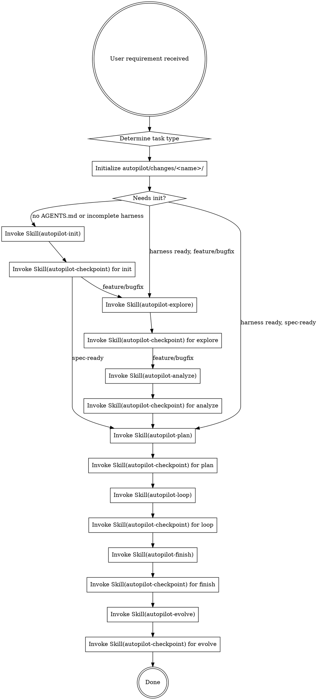

# Neil Coding Autopilot

AI 全托管开发编排器。从需求到部署的全自动开发流水线。

<HARD-GATE>
当用户要求开发一个功能或执行 spec 时，必须满足以下**不变量**（无论用哪种执行档位）：
1. 需求澄清（explore）：动手前确认边界与设计方向，不臆测。
2. 分支纪律：**每次变动先开功能分支**（`<type>/<feature-name>`，type ∈ feature/fix/refactor）；实现前自检当前分支，若在 `main`/`master` 上必须先切分支——**禁止在主干直接改**。
3. Code Review：改动完成后必须经过 CR（autopilot-review），未审不得进入 finish。
4. 验证：合并 / 部署前跑通验证命令（编译 / 测试 / 自检）。
5. 知识沉淀（evolve）：把 CR 发现的规律与踩坑写回知识库。
6. 状态可追溯：进度写入 `progress.md`（档位 A），或以 TodoWrite 为单一状态源（档位 B）——不靠记忆。
7. 可观测验收：user-facing 改动（改变 UI/CLI/API/告警/报表等终端可观测输出）必带「可观测验收」——每个可观测值/态给出 SSOT + 不变量 + 蜕变关系（多源值含判别样例），其确定性扰动测试即该 Task 的 `**Verify**`；不可离线验证者须 `UNVERIFIED-OBSERVABLE` 醒目登记转 Phase 2、禁静默放行；结构缺失（无验收段且无可证伪免除）→ `BLOCKED|{原因}` 立即 exit、禁挂起。详见 `_shared/observable-acceptance.md`（headless 运行期拦截限可离线派生层；纯渲染/错 SSOT 交 Phase 2）。

**HARD-GATE 约束的是"必须发生什么"（不变量），不是"用哪种机制"（见「执行档位」）。**
</HARD-GATE>

## 触发条件

以下任一条件满足即触发 autopilot 流程：
- 用户说"跑 autopilot""全自动""从需求到部署""AI 全托管"
- 用户说"开发 spec.md""按照 spec 开发""实现 spec"
- GitHub Issue 标记 `autonomous` label
- 用户提了一个功能需求且期望 AI 端到端完成

## 执行档位（Execution Tracks）

> **铁律：控制器永不内联写码。** 所有开发（implement→verify→review→fix→commit 内循环）**一律经 `scripts/run-track-a.sh` 托管给 fresh qodercli worker**——控制器只写 prompt、收日志摘要 + 状态行，不读源文件、不看 diff。开发细节全部活在 worker 的独立 context 里，控制器 context 不随开发膨胀。

两档**只差"外层阶段是否有人在交互"**，开发都托管、都走同一个 `run-track-a.sh`：

| 档位 | 何时用 | 外层阶段(explore/analyze/plan/finish/evolve) | loop(开发) | 状态源 |
|------|--------|----------------------------------------------|-----------|--------|
| **A · 无人值守 (Autonomous)** | CI / 后台批量 / spec-ready / 需求已明确 | headless（spec-ready 跳过 explore/analyze） | 从终端起 `run-track-a.sh` 端到端跑完 | `progress.md` + `tasks.md`(脚本维护) |
| **B · 交互 (Interactive)** | 会话内协作 / 需求要边聊边澄清 | 控制器在会话内跟用户跑（可随时插话） | 控制器**调 `run-track-a.sh`** 跑 loop（同样托管 qodercli） | TodoWrite(阶段级) + `tasks.md`(Task 级,脚本维护) + `spec.md` |

**判定规则**：
- 需求要跟用户边聊边澄清 / 期望边做边看 → **档位 B**（交互编排 + 托管 loop）。
- 需求已明确 / spec-ready / 无人值守 / CI → **档位 A**（终端起 run-track-a.sh 端到端）。
- 拿不准 → 默认 **B**。
- **无论哪档，loop 的开发都由 `run-track-a.sh` 托管给 qodercli——控制器绝不在会话内内联写码。**

**两档都必须满足 HARD-GATE 的全部不变量。** 档位只决定外层阶段是否交互，不决定是否 explore / CR / verify / evolve，也不决定开发是否托管（**永远托管**）。

### run-track-a.sh —— 开发托管的唯一入口（两档通用）

`scripts/run-track-a.sh` 是**确定性 bash 编排器**：读 `tasks.md`，逐 Task 经 dispatch.sh spawn fresh qodercli worker，跑 implement→verify→review→fix→commit（fail-closed；退出码 0=全 DONE / 2=BLOCKED）。编排器是脚本（零 context、可续跑、可 dry-run），worker 是每步一次性 fresh qodercli。

```bash
# 从业务项目根启动；控制器(档位 B 交互) 或终端(档位 A 无人值守) 都用这一条
RUNNER="$(dirname "$DISPATCH")/run-track-a.sh"   # 与 dispatch.sh 同目录（$DISPATCH 解析见 conventions）
bash "$RUNNER" --change-dir autopilot/changes/<feature> --cwd "$PROJECT_ROOT"
# --dry-run 先看计划(不烧 token)；--resume 断点续跑；--max-rounds N 控 CR 轮数
```

- **控制器（档位 B）**：会话内 `bash run-track-a.sh ...`，只看 driver 日志摘要、不碰开发细节；跑完在会话内继续 finish/evolve。
- 别用"起一个 qodercli 当编排器、让它自己读 SKILL 循环"——那把 context-rot 搬到编排器、非确定、难调试（调研见 `autopilot/knowledge/wiki/guides/track-a-launcher-pattern.md`）。
- **前置**：`run-track-a.sh` 依赖同目录 dispatch.sh / parse-status.sh / task-state.sh；超时依赖 `timeout`/`gtimeout`（macOS 需 `brew install coreutils`，缺失自动降级）。跑前先 `bash scripts/smoke-dispatch.sh` + `bash scripts/smoke-run-track-a.sh` 冒烟自检（不烧 token）。
- **`run-track-a.sh` 仍是纯 loop-only 托管入口**（只跑开发内循环）；`scripts/run-autopilot.sh` 是档位 A 的端到端编排器，链式跑完 loop（`run-track-a.sh`）→ finish → evolve 三阶段（fail-closed，任一阶段 BLOCKED 即停不接力）。跑前可先 `bash scripts/smoke-run-autopilot.sh` 冒烟自检（不烧 token）。

## 任务类型分流

| 类型 | 判断条件 | 流程 |
|------|---------|------|
| new-project | 新项目/无 AGENTS.md | init → explore → analyze → plan → loop → finish → evolve |
| feature | 新功能/用户说"新增" | init(条件) → explore → analyze → plan → loop → finish → evolve |
| bugfix | 用户说"修复/fix/bug" + 已有代码 | init(条件) → explore(轻量) → analyze(轻量) → plan → loop → finish → evolve |
| spec-ready | 用户提供了 spec 或说"按照 spec" | init(条件) → plan → loop → finish → evolve（跳过 explore + analyze） |

bugfix 类型走轻量 analyze（仅生成最小化 spec：bug 范围 + 修复方向 + 验证方法）。
spec-ready 类型将 explore 和 analyze 都标记为 `[x] ... (skipped)`。
init 阶段在项目已有完整 harness 时标记为 `[x] init (skipped)`。

## 目录结构

autopilot 的所有产物统一管理在项目根目录的 `autopilot/` 下（**完整形态**如下；实际**按需生长**，`autopilot-init` 不预建空目录 / 空状态机文件）：

```
autopilot/
├── changes/                      # 活跃的开发变更（每次 run 一个文件夹）
│   └── <feature-name>/           # 如 add-user-registration/
│       ├── spec.md               # 本次变更的技术方案
│       ├── tasks.md              # Task 拆解（两档都产，run-track-a.sh 输入；小 spec 可 1 Task）
│       ├── progress.md           # 工作流状态（档位 A）
│       └── explore-notes.md      # 澄清阶段的对话记录摘要
│
├── archive/                      # 已完成的历史变更
│   └── YYYY-MM-DD-<feature>/     # 如 2026-07-06-video-distributor/
│       ├── spec.md
│       ├── tasks.md
│       └── summary.md            # 完成摘要
│
├── knowledge/                    # Karpathy LLM Wiki 三层知识库
│   ├── SCHEMA.md                 # 维护规则 + 项目元数据（≤200行）
│   ├── raw/                      # Layer 1: 不可变源（CR/踩坑/代码快照）
│   ├── wiki/                     # Layer 2: LLM 编译产物（index + entities/concepts/guides/comparisons）
│   └── references/               # 静态框架性内容
│
└── hooks/                        # 质量门禁（Feedback/Sensor Layer）
    ├── post-edit.sh              # 变更后自动检查
    ├── build-gate.sh             # 编译验证
    └── pre-completion.md         # 完成前自检清单
```

## 初始化流程

执行任何阶段前，先切功能分支、再建立变更目录：

```bash
FEATURE_NAME="<feature-name>"   # 从需求提取的 kebab-case 标识
TYPE="fix"                      # 任务类型 → feature | fix | refactor（见「任务类型分流」）

# 分支纪律（HARD-GATE #2）：禁止在主干直接改；当前在 main/master 则先切功能分支
CUR="$(git rev-parse --abbrev-ref HEAD 2>/dev/null || echo '')"
case "$CUR" in
  main|master) git checkout -b "${TYPE}/${FEATURE_NAME}" ;;
  *) echo "已在功能分支 $CUR，继续" ;;
esac

mkdir -p autopilot/changes/${FEATURE_NAME}

# 运行期哨兵：激活「控制器写码硬门禁」(hooks/guard-controller-write.sh 仅在此哨兵存在时 deny)。
# 记录 epoch + PID 便于排障；由 finish/evolve 结束时移除。异常残留超 12h 视为陈旧，guard 自动忽略，
# 避免误锁日常编码（人工可随时 rm -f autopilot/.run-active 逃生）。
mkdir -p autopilot
{ date +%s; echo "pid=$$"; echo "started=$(date '+%Y-%m-%d %H:%M:%S')"; } > autopilot/.run-active

# 哨兵是瞬时运行态、非交付物：确保被 .gitignore 排除，否则 run-track-a.sh 的
# `git add -A`（逐 Task 提交）会把它卷进被开发项目的提交历史。幂等追加。
grep -qxF 'autopilot/.run-active' .gitignore 2>/dev/null || printf '%s\n' 'autopilot/.run-active' >> .gitignore
```

- **档位 A**：写 `progress.md`（下方模板）作为落盘状态源。
- **档位 B**：以 TodoWrite 为状态源；`progress.md` 可选。

知识库（`autopilot/knowledge/**`）与 hooks 目录**不在此处预建空目录**——由 `autopilot-init` 按需生长（缺什么建什么），避免留下空壳。

progress.md 模板（档位 A / 需要落盘时）：

```bash
cat > autopilot/changes/${FEATURE_NAME}/progress.md << 'EOF'
# Autopilot Progress

> Auto-maintained by autopilot workflow. Do not edit manually.
> Feature: [feature name]
> Branch: [branch name]
> Started: YYYY-MM-DD HH:mm

- [ ] init
- [ ] explore
- [ ] analyze
- [ ] plan
- [ ] loop
- [ ] finish
- [ ] evolve
EOF
```

替换 `[feature name]`、`[branch name]`、`YYYY-MM-DD HH:mm` 为实际值。

**向下兼容**：如果项目根目录存在旧的 SPEC.md/tasks.md/.autopilot/，首次运行时提示用户归档到 `autopilot/archive/`。

## 完整流程

> 下图是完整阶段编排（两档同序）。**档位 B（交互）**：explore/analyze/plan/finish/evolve 由控制器在会话内执行、TodoWrite 记录阶段状态、checkpoint 以"自查前置不变量"替代；**loop 阶段两档都调 `run-track-a.sh` 托管 qodercli**（控制器不内联写码）。



## 使用方式

```
# 有现成 spec 的项目
/neil-coding-autopilot "按照 spec.md 开发整个项目"

# 从需求开始
/neil-coding-autopilot "添加用户注册功能，支持邮箱和手机号"

# GitHub Issue 驱动
/neil-coding-autopilot --issue https://github.com/user/repo/issues/42

# Bug 修复（轻量 explore + 跳过 analyze）
/neil-coding-autopilot "修复登录页面 token 过期未刷新的问题"
```

## Skill 调用规则

### 通用（两档都适用）
1. 先声明当前**执行档位**（A 无人值守 / B 交互）。
2. 不得跳过 **explore**（需求澄清强制）。
3. 不得跳过 **CR**（未审变更不得进入 finish）。
4. 不得跳过 **evolve**（知识沉淀强制）。
5. **loop 的开发一律经 `run-track-a.sh` 托管 qodercli**——控制器不内联写码。
6. 任何 skill / worker 报告 **BLOCKED** → 停止流程并通知用户。

### 档位 A（无人值守）
- explore/analyze/plan 若已 headless 就绪（或 spec-ready），从终端起 `run-track-a.sh` 端到端跑 loop。
- 每阶段完成后调用 `Skill("autopilot-checkpoint")` 校验前置并标记 `progress.md`。
- 阶段间完成状态以 `progress.md` 为唯一事实源。

### 档位 B（交互）
- 控制器在会话内跑 explore/analyze/plan（跟用户交互）+ finish/evolve，**TodoWrite 为阶段级状态源**。
- **loop：控制器 `bash run-track-a.sh ...` 托管开发**（只看日志摘要，不内联写码）；Task 级状态由脚本写进 tasks.md。
- 以"自查前置不变量"替代 checkpoint-skill 调用。
- 仍需在变更目录落盘 `spec.md`（设计留痕）+ `tasks.md`（run-track-a.sh 输入，可小到 1 Task）；`progress.md` 可选。

**路由职责完全在控制器**：各 skill 只报告状态，不负责调度下一阶段。
详细约定见 `_shared/conventions.md`。

## 路径约定

详见 `_shared/conventions.md`。控制器在调度时确定具体值：

| 变量 | 含义 |
|------|------|
| $CHANGE_DIR | 当前变更目录 |
| $KNOWLEDGE_DIR | 知识库目录 |
| $HOOKS_DIR | 质量门禁目录 |
| $ARCHIVE_DIR | 归档目录 |

## 恢复机制

如果流程因中断需要恢复：

1. 检查 `autopilot/changes/` 下是否有活跃的变更目录
2. 读取其 `progress.md`（档位 A）或 TodoWrite 状态（档位 B）确定最后完成的阶段
3. 从下一个未完成阶段继续执行
4. 不重复已完成的阶段
