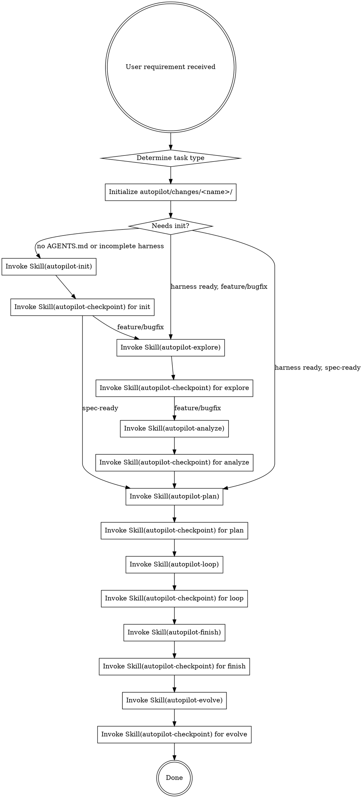

何时读我：需要查看完整阶段编排、checkpoint 路由或 DOT 流程图时。

## 完整流程

> 下图是完整阶段编排（两档同序）。**档位 B（交互）**：explore/analyze/plan/finish/evolve 由控制器在会话内执行、TodoWrite 记录阶段状态、checkpoint 以"自查前置不变量"替代；**loop 阶段两档都调 `run-track-a.sh` 托管 qodercli**（控制器不内联写码）。

